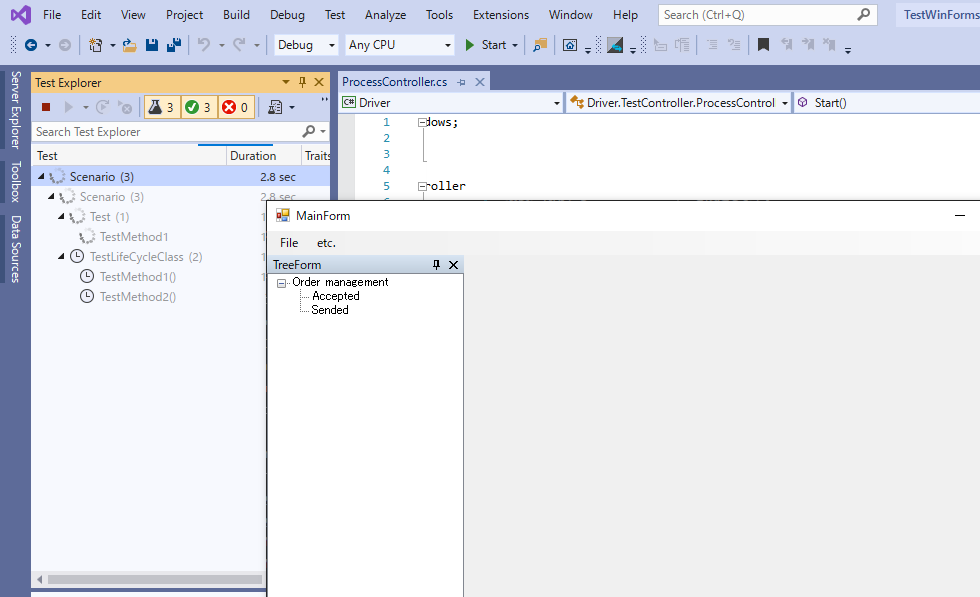

# テストソリューションを新規作成する

TestAssistantProではWinFormsアプリケーションの自動テストに最適なVisual Studioソリューションを作成するためのテンプレートウィザードが提供されています。
ウィザードに従ってプロジェクトを作成すると自動的に次の3つのプロジェクトが作成されます。


プロジェクト       | 説明
----------------|---------------
Driver          | テスト対象アプリケーションのプロセスの制御や操作を行う処理が定義されています。画面やコントロールの操作をカプセル化するためのコードはここに記述します。
Driver.InTarget | テスト対象アプリケーションのプロセス内に埋め込むコードを記述します。外部からの操作で実現が難しい処理はここに記述してください。
Scenario        | 実際のテストを実行するテストコードを記述します。テストシナリオに沿ってテストコードを記述してください。


<!--
* Driver
    * Codeer.Friendly
    * Codeer.Friendly.Windows
    * Codeer.Friendly.Windows.Grasp
    * Codeer.Friendly.Windows.KeyMouse
    * Codeer.Friendly.Windows.NativeStandardControls
    * Codeer.TestAssistant.GeneratorToolKit
    * Ong.Friendly.FormsStandardControls
* Driver.InTarget
    * Codeer.TestAssistant.GeneratorToolkit
* Scenario
  * Codeer.Friendly
  * Codeer.Friendly.Windows
  * Codeer.Friendly.Windows.Grasp
  * Codeer.Friendly.Windows.KeyMouse
  * Codeer.Friendly.Windows.NativeStandardControls
  * Codeer.TestAssistant.GeneratorToolKit
  * Ong.Friendly.FormsStandardControls
  * NUnit
-->

これらの3つのプロジェクトは基本構成です。作業を進めることでボリュームが大きくなってきた場合、それぞれの役割を持つプロジェクトを複数に分割していくことも可能です。

> TestAssistantProはこの構成以外でもドライバーの作成やシナリオの作成を行うことができます。
> Org.Friendly.FormsStandardControlsがインストールされているプロジェクトで使うことが可能です。

<!--
TODO: いったんコメントアウト。自動生成されるコードがNUnitに依存しすぎている場合、別のフレームワークを採用することは非現実的なので記述から外す
> テストフレームワークもNUnitが入りますが、これもNUnitである必要はありません。プロジェクトに適したものを採用してください。
-->

## ウィザードを利用してプロジェクトを追加する

Visual Studioを起動して「新しいプロジェクトの追加」ダイアログを表示します。「テンプレートの検索」テキストボックスに"Test"と入力してプロジェクトリストを更新します。
更新されたプロジェクトリストの中から「TestAssistantPro WinForms Test Project」を選択して、「次へ」ボタンを押下します。


「新しいプロジェクトを構成します」画面表示されるため任意のプロジェクト名と場所を入力して「作成」ボタンを押下してください。


最後に利用する.netのバージョンを設定します。

「Application(Driver.InTarget)」はDriver.InTargetプロジェクトで利用するバージョンを指定します。テスト対象のアプリケーションにインジェクトションされるコードとなるため、必ずテスト対象のアプリケーションで利用されている.netのバージョン以下の値を指定する必要があります。
「Test(Driver, Schenario)」には、必ず「Application(Driver.InTarget)」のバージョン以上を指定してください。

サンプルアプリケーションは .NET Framework 4.5が利用されてます。そのため「Application(Driver.InTarget)」には「.NET Framework 4.5」を選択する必要があります。


適切なバージョンを選択し、「OK」をクリックしてください。入力した内容をもとに3つのプロジェクトが「ソリューションエクスプローラー」で確認できます。
また、「Scenario」プロジェクトにサンプルのテストが配置されていることが「テストエクスプローラー」から確認できます。


## テスト対象アプリケーションのパスを指定する

テスト対象アプリケーションをテストするために、テスト対象アプリケーションの実行ファイルのパスを指定します。
「Driver」プロジェクトのTestController/ProcessController.csファイルを開いて、targetPath変数にパスを設定してください。

```cs
using Codeer.Friendly.Windows;
using System.Diagnostics;
using System.IO;

namespace Driver.TestController
{
    public static class ProcessController
    {
        public static WindowsAppFriend Start()
        {
            //※ここを書き換えます。
            var targetPath = @"C:\GitHub\TestAssistantPro.Manual\WinForms\WinFormsApp\bin\Debug\WinFormsApp.exe";
            var info = new ProcessStartInfo(targetPath) { WorkingDirectory = Path.GetDirectoryName(targetPath) };
            var app = new WindowsAppFriend(Process.Start(info));
            app.ResetTimeout();
            return app;
        }

        public static void Kill(this WindowsAppFriend app)
        {
            if (app == null) return;

            app.ClearTimeout();
            try
            {
                Process.GetProcessById(app.ProcessId).Kill();
            }
            catch { }
        }
    }
}
```

## テストを実行して動作を確認する

「テストエクスプローラー」からテストを実行して問題なくテストソリューションが作成できているかを確認してください。
テストを実行するとテスト対象アプリケーションが起動して、自動的に終了され、テストが成功することを確認できます。



## 次の手順

ここまでテストを実装するためのテストソリューションを作成できました。
次はテスト対象アプリケーションをテストシナリオから操作しやすいようにするためのドライバを作成します。

[アプリケーションをキャプチャしてWindowDriverおよびUserControlDriverを作成する](WindowDriver.md)