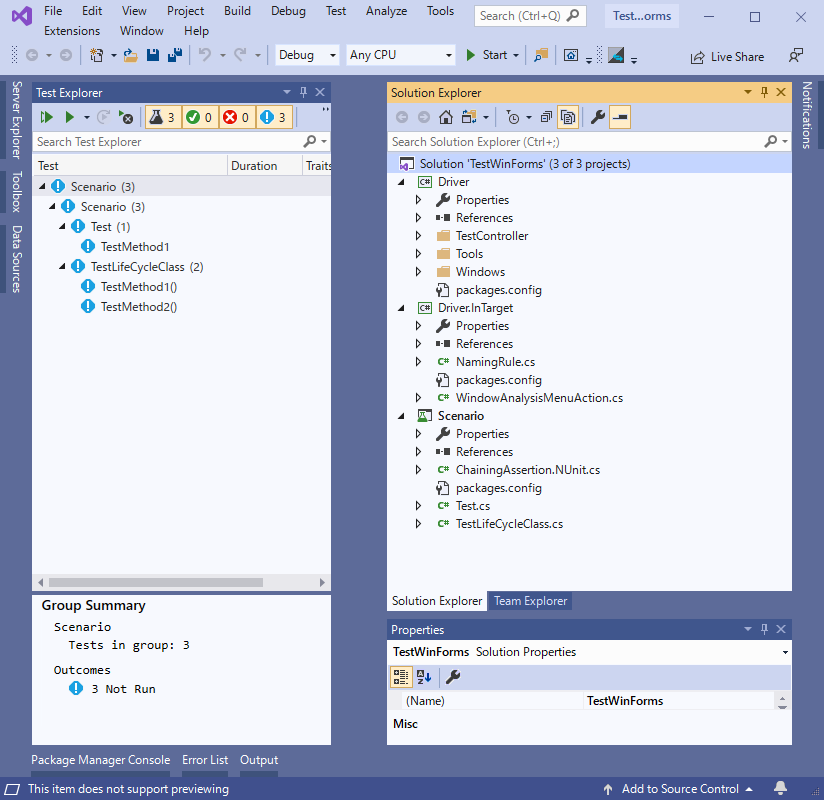

# テストソリューションの新規作成

テストソリューションの新規作成について説明します。 
TestAssistantProを使うことでWinFormsのアプリの自動テストに最適なソリューションを作成することができます。 
ウィザードに従うと以下のプロジェクトを作成し、それぞれに必要な最新のNugetパッケージをインストールします。 

* Driver
    * Codeer.Friendly
    * Codeer.Friendly.Windows
    * Codeer.Friendly.Windows.Grasp
    * Codeer.Friendly.Windows.KeyMouse
    * Codeer.Friendly.Windows.NativeStandardControls
    * Codeer.TestAssistant.GeneratorToolKit
    * Ong.Friendly.FormsStandardControls
* Driver.InTarget
    * Codeer.TestAssistant.GeneratorToolkit
* Scenario
  * Codeer.Friendly
  * Codeer.Friendly.Windows
  * Codeer.Friendly.Windows.Grasp
  * Codeer.Friendly.Windows.KeyMouse
  * Codeer.Friendly.Windows.NativeStandardControls
  * Codeer.TestAssistant.GeneratorToolKit
  * Ong.Friendly.FormsStandardControls
  * NUnit

ここで作るのは基本構成です。 
作業が進みボリュームが大きくなってきた場合、必要に応じてそれぞれの役割を持つdllを複数個に分割していくことも可能です。 
TestAssistantProはこの構成以外でもDriverの作成やシナリオの作成を行うことができます。 
それらはOng.Friendly.FormsStandardControlsがインストールされているプロジェクトで使うことが可能です。 
テストフレームワークもNUnitが入りますが、これもNUnitである必要はありません。プロジェクトに適したものを採用してください。 

# 手順
## テンプレート選択
検索ウィンドウに Test と入力して検索してください。 
（表示されない場合はスクロールで下を見てください） 
TestAssistantPro WinForms Test Project を選択して Nextボタンを押します。 

## プロジェクト情報入力
任意でパスと名称を入力します。 

## .netのバージョン入力
.Netのバージョンを入力します。Applicationはテスト対象のプロジェクト以下のバージョンにしてください。 
Testの方はApplicationのバージョン以上を指定してください。 

## 作成されたソリューション

## ProcessControllerの調整
コードを作成する前に生成されているProcessControllerを調整しましょう。
TODO
