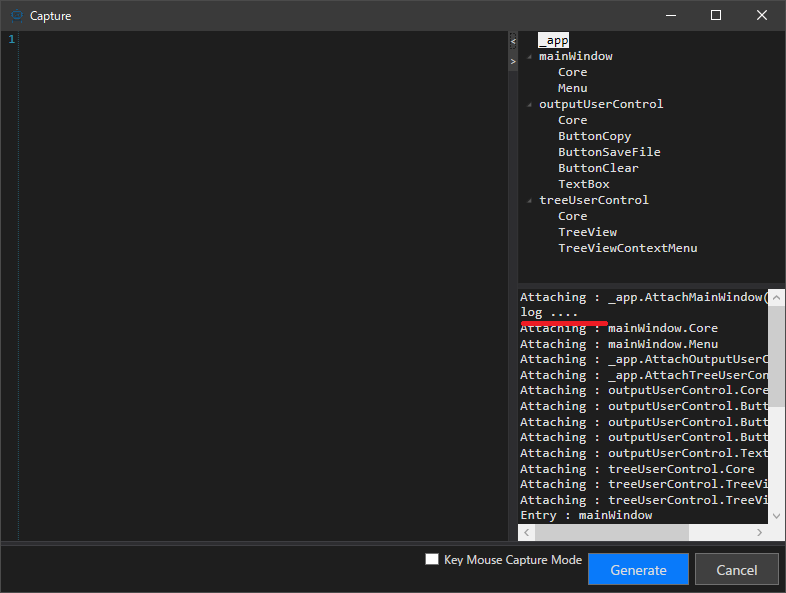

# WindowDriver/UserControlDriverの作成

ここでは WindowDriver/UserControlDriver の作成方法に関して説明します。
WindowDriver/UserControlDriver に関しては[こちら](https://github.com/Codeer-Software/Friendly/blob/master/TestAutomationDesign.jp.md)を参照お願いします。

# AnalyzeWindow
AnalyzeWindow は対象のアプリを解析して WindowDriver を作成するものです。
ツリーのルートのコントロールに対して WindowDriver を作成します。
Designer タブの設定でコードを作ります。
現在の設定で生成されるコードは Current Code タブでプレビューを見ることができます。

### 起動
Driver/Windowsフォルダで右クリックから Analyze Window を選択してください。


これはどこのフォルダでも可能です。ドライバを生成したときに指定のフォルダに生成されます。
対象アプリを選択する画面が出ますので、対象を選択してください。


ここで選択するとFriendlyの機能によって対象アプリにFriendly系のdllとDriver.InTarget.dllがインジェクションされます。
間違ったアプリを選択するとOSの再起動が必要になる場合がありますので間違えないように選択してください。
二回目以降はこれが表示されずに同一のアプリに対して Analyze Window が実行されます。
途中で対象アプリを変えたい場合は Select Target を実行すると対象を変更することができます。


### Tree
コントロールを選択します。
ツリーで選択すると対象アプリの対応するコントロールが赤枠で囲まれます。
Ctrlキーを押しながら対象のアプリのコントロールにマウスを持っていくとツリーの対応するノードが選択されます。

* ダブりクリック
    * WindowDriver のプロパティとして登録したいコントロールをダブルクリックすると右側のグリッドに登録されます。

* 右クリックメニュー
    * Pickup<br>
        選択している要素が右側のグリッドに登録されます。<br>
    * Pickup Children <br>
        指定したコントロールの子孫のコントロールでドライバが割り当たっているものを一括でピックアップしてグリッドに登録します。<br>
        子孫をたどるときに UserControl を発見した場合はそれ以下は検索しません。<br>
        それ以下のコントロールもグリッドに登録したい場合はそのUserControlを選択し再度 Pickup Children を実行してください。<br>
    * Create Control Driver<br>
        コントロールドライバを作成します。<br>
        詳細はこちらで説明します。<br>
    * Show Base Class<br>
        選択したコントロールの親クラスをアウトプットウィンドウに表示します。<br>
    * Expand All<br>
        ツリーを全て開きます。<br>
    * Close All<br>
        ツリーをすべて閉じます。<br>

    ※右クリックメニューはカスタマイズできます。詳しくは[こちら](Customize.md#Treeのコンテキストメニューの拡張)

### メニュー
* Display Mode <br>
    表示モードです
    * Control<br>
        Control.Controls を元にしたツリーを表示します。<br>
    * Field<br>
        Field を元にしたツリーを表示します。<br>
    * Filter Window And UserControl<br>
        Form と UserControl のみをツリー上に表示します。<br>

* Tree Update<br>
    * Auto Update<br>
        Tree を更新するタイミングを設定します。通常はONで使ってください。あまりにも画面の要素が頻繁に更新される場合は動作が重くなるのでチェックをOFFにしてください。<br>
    * Update Now<br>
        Tree を更新します。<br>
    * Sync with Visual Studio<br>
        Visual Studio 同期します。AnalyzeWindow 上で選択した要素に対応するドライバ上での行が VisualStudio 上で選択されます。またその逆に VisualStudio 上で行を選択するとAnalyzeWindow 上で対応するコントロールが選択されます。
* Tool<br>
    * Compile & update<br>
        AnalyzeWindow の情報が現在の Visual Stuido のドライバコードをコンパイルしたものに更新されます。
    * Option<br>
        PickupChildren で拾ってくるコントロールの種類を選択します。
### Designerタブ
* Type<br>
    コントロールのタイプフルネームが表示されます。<br>
* Assigned Driver<br>
    割り当たってる Driver のタイプフルネームが表示されます。<br>
* Class Name<br>
    作成する WindowDriver/UserControlDriver の名前です。<br>
    ネームスペースは AnalyzeWindow を始めたフォルダになります。<br>
* Create Attach Code<br>
    AttachMethod を作るか否かです。<br>
* Extension<br>
    Attach する対象クラスです。<br>
* Method<br>
    特定方法です。<br>
    * Type Full Name
        .Net の TypeFullName で特定します。<br>
    * Window Text<br>
        Win32 の WindowText で特定します。<br>
    * Variable Window Text<br>
        WindowText から特定しますが常に同じ WindowText でない場合に使います。<br>
    * Custom<br>
        カスタムの特定手法です。<br>

* Many Exists<br>
    複数存在する場合があるかです。<br>

* Grid<br>
    WindowDriver/UserControlDriver の子要素です。<br>
    Tree から選択します。<br>

※Attachに関しては[Attachに関して](#Attachに関して)を参照してください。

### Current Code タブ
Designer タブでの設定によって出力されるコードが表示されます。

### Propertyタブ
選択しているコントロールのプロパティが表示されます。

### Outputタブ
メニューによって実行した結果が表示されます。

# コード
WindowDriverとUserControlDriverの役割はほとんど同じでコントロールドライバを特定して取得することです。
それ自体を取得するためにAttachMethodを作ります。
UserControlDriverの場合はControlDriver同様に親のWindowDriverの子要素として普通にPropertyで取得することもあります。
```cs
using Codeer.Friendly;
using Codeer.Friendly.Dynamic;
using Codeer.Friendly.Windows;
using Codeer.Friendly.Windows.Grasp;
using Codeer.TestAssistant.GeneratorToolKit;
using Ong.Friendly.FormsStandardControls;

namespace Driver.Windows
{
    //WindowDriverであることを明示します。
    //対応するWindowのタイプフルネームを指定します。
    //WindowDriverAttributeを付けることでTestAssistantProが
    //AnalyzeWindowでコントロールに対してすでにドライバが割り当てられていることを検知します。
    [WindowDriver(TypeFullName = "XXX.YForm")]
    public class YFormDriver
    {
        //Fromに対応する変数
        public WindowControl Core { get; }

        //ControlDriverを並べる
        //ControlDriverを特定するのが責務
        public FormsButton _buttonCancel => Core.Dynamic()._buttonCancel; 
        public FormsButton _buttonOK => Core.Dynamic()._buttonOK; 
        public FormsRichTextBox _richTextBoxRemarks => Core.Dynamic()._richTextBoxRemarks; 

        public YFormDriver(WindowControl core)
        {
            Core = core;
        }

        public YFormDriver(AppVar core)
        {
            Core = new WindowControl(core);
        }
    }

    public static class YFormDriverExtensions
    {
        //アプリケーションからYFormを特定して取得します。
        //WindowDriverIdentifyAttributeを付けることでTestAssistantProがこのメソッドを使えるようになります。
        //Attachについては後述します。
        [WindowDriverIdentify(TypeFullName = "XXX.YForm")]
        public static YFormDriver AttachYForm(this WindowsAppFriend app)
            => app.WaitForIdentifyFromTypeFullName("XXX.YForm").Dynamic();
    }
}
```
```cs
using Codeer.Friendly;
using Codeer.Friendly.Dynamic;
using Codeer.Friendly.Windows.Grasp;
using Codeer.TestAssistant.GeneratorToolKit;
using Ong.Friendly.FormsStandardControls;

namespace Driver.Windows
{
    //UserControlDriverであることを明示します。
    //対応するUserControlのタイプフルネームを指定します。
    //UserControlDriverAttributeを付けることでTestAssistantProが
    //AnalyzeWindowでコントロールに対してすでにドライバが割り当てられていることを検知します。
    [UserControlDriver(TypeFullName = "XXX.ZUserControl")]
    public class ZUserControlDriver
    {
        //UserControlに対応する変数
        public WindowControl Core { get; }

        //ControlDriverを並べる
        //ControlDriverを特定するのが責務
        public FormsRadioButton _radioA => Core.Dynamic()._radioButtonAlacarte; 
        public FormsRadioButton _radioB => Core.Dynamic()._radioButtonCourse; 

        public ZUserControlDriver(WindowControl core)
        {
            Core = core;
        }

        public ZUserControlDriver(AppVar core)
        {
            Core = new WindowControl(core);
        }
    }
    
    public static class ZUserControlDriverExtensions
    {
        //YFormDriverからZUserControlを特定して取得します。
        //UserControlDriverIdentifyAttributeを付けることでTestAssistantProがこのメソッドを使えるようになります。
        //Attachについては後述します。
        [UserControlDriverIdentify()]
        public static ZUserControlDriver AttachZUserControl(this YFormDriver parent)
            => parent.GetFromTypeFullName("XXX.ZUserControl").SingleOrDefault()?.Dynamic();
    }
}
```
# Attachに関して
Attachは拡張対象のWindowAppFriend/Driverから求めるWindowDriver/UserControlDriverを取得します。
出力されるコードとしてはWindowDriverを取得する拡張メソッドは無限待ちで実装されます。
これはテスト実行時のトップレベルウィドウの待ち合わせを考えてのものです。
UserControlDriverを取得する方はなければnullを返すというコードが生成されます。
以下のパターンがそれぞれあります。

## WindowDriverIdentifyAttribute
### TypeFullName
```cs
public static class MainFormDriverExtensions
{
    [WindowDriverIdentify(TypeFullName = "WinFormsApp.MainForm")]
    public static MainFormDriver AttachMainForm(this WindowsAppFriend app)
        => app.WaitForIdentifyFromTypeFullName("WinFormsApp.MainForm").Dynamic();
}
```
### WinodwText
```cs
    
public static class MainFormDriverExtensions
{
    [WindowDriverIdentify(WindowText = "Text ...")]
    public static MainFormDriver AttachMainForm(this WindowsAppFriend app)
        => app.WaitForIdentifyFromWindowText("Text ...").Dynamic();
}
```
### Custom
キャプチャ時にTryが先に呼び出されます。
そこで対象が見つかって検索に必要な識別子を作成できたら true を返すように実装します。
```cs
public static class MainFormDriverExtensions
{
    [WindowDriverIdentify(CustomMethod = "Try")]
    public static MainFormDriver AttachMainForm(this WindowsAppFriend app, T identifier)
    {
    }

    public static bool Try(WindowControl window, out T identifier)
    {
    }
}
```
### Variable Window Text
これは Custom の実装の一つです。WindowTextを元に識別しています。
```cs
public static class MainFormDriverExtensions
{
    [WindowDriverIdentify(CustomMethod = "Try")]
    public static MainFormDriver AttachMainForm(this WindowsAppFriend app, string identifier)
        => app.WaitForIdentifyFromWindowText(identifier).Dynamic();

    public static bool Try(WindowControl window, out string identifier)
    {
        identifier = window.GetWindowText();
        return window.TypeFullName == "WinFormsApp.MainForm";
    }
}
```
## UserControlDriverIdentifyAttribute

### TypeFullName
```cs
public static class XUserControlDriverExtensions
{
    [UserControlDriverIdentify]
    public static XUserControlDriver AttachXUserControl(this ParentDriver parent)
        => parent.Core.GetFromTypeFullName("WinFormsApp.XUserControlDriver").SingleOrDefault()?.Dynamic();
}
```

### WinodwText
```cs
public static class XUserControlDriverExtensions
{
    [UserControlDriverIdentify]
    public static XUserControlDriver AttachXUserControl(this ParentDriver parent)
        => parent.Core.GetFromWindowText("Text...").SingleOrDefault()?.Dynamic();
}
```

### Custom
キャプチャ時にTryが先に呼び出されます。
見つかった分だけ識別子を返します。
```cs
public static class XUserControlDriverExtensions
{
    [UserControlDriverIdentify(CustomMethod = "TryGet")]
    public static XUserControlDriver AttachXUserControl(this ParentDriver parent, T identifier)
    {
    }

    public static void TryGet(this ParentDriver parent, out T[] identifier)
    {
    }
}
```

### Variable Window Text
これは Custom の実装の一つです。WindowTextを元に識別しています。
```cs
public static class XUserControlDriverExtensions
{
    [UserControlDriverIdentify(CustomMethod = "TryGet")]
    public static XUserControlDriver AttachXUserControl(this ParentDriver parent, string text)
        => parent.Core.IdentifyFromWindowText("").Dynamic();

    public static void TryGet(this ParentDriver parent, out string[] texts)
        => texts = parent.Core.GetFromTypeFullName("WinFormsApp.XUserControlDriver").Select(e => (string)e.Dynamic().Text).ToArray();
}
```

### アプリケーション全体からの検索
特定の WindowDriver/UserControlDriver から検索する以外にアプリケーション全体から探す方法もあります。
WindowsAppFriendの拡張にすると以下のようにアプリケーション全体から検索できます。
```cs
public static class XUserControlDriverExtensions
{
    [UserControlDriverIdentify()]
    public static XUserControlDriver AttachOutputForm(this WindowsAppFriend app)
        => app.GetTopLevelWindows().SelectMany(e => e.GetFromTypeFullName("WinFormsApp.XUserControlDriver")).SingleOrDefault()?.Dynamic();
}
```

# デバッグ
これらの WindowDriver/USerControlDriver はテスト中はもちろん Capture 中にも使われます。
上手くキャプチャ出来ない場合はデバッグして原因を突き止めてください。
Ctrl キーを押しながら Capture するとデバッグできます。
Attach メソッドをカスタマイズした場合などデバッグの必要性が出てくると思います。
ログを出したい場合は Logger を 使えば Capture ウィンドウにログを出力できます。
現在 Capture中なのかどうかは TestAssistantMode を使うと判定できます。
Capture 中だけの処理を書きたい場合に便利です。
WinFormsのDesignModeのイメージで使ってください。
```cs
using Codeer.Friendly;
using Codeer.Friendly.Dynamic;
using Codeer.Friendly.Windows;
using Codeer.Friendly.Windows.Grasp;
using Codeer.TestAssistant.GeneratorToolKit;
using Ong.Friendly.FormsStandardControls;

namespace Driver.Windows
{
    [WindowDriver(TypeFullName = "WinFormsApp.MainForm")]
    public class MainFormDriver
    {
        public WindowControl Core { get; }
        public FormsToolStrip _menuStrip => Core.Dynamic()._menuStrip; 

        public MainFormDriver(WindowControl core)
        {
            Core = core;
        }

        public MainFormDriver(AppVar core)
        {
            Core = new WindowControl(core);
        }
    }

    public static class MainFormDriverExtensions
    {
        [WindowDriverIdentify(TypeFullName = "WinFormsApp.MainForm")]
        public static MainFormDriver AttachMainForm(this WindowsAppFriend app)
        {
            switch (TestAssistantMode.CurrentMode)
            {
                //TestAssistantPro以外で実行
                case TestAssistantMode.Mode.Non:
                    break;
                //AnalyzeWindowから呼ばれた場合
                case TestAssistantMode.Mode.Analyze:
                    break;
                //Captureから呼ばれた場合
                case TestAssistantMode.Mode.Capture:
                    break;
                //Executeから呼ばれた場合
                case TestAssistantMode.Mode.Execute:
                    break;
            }

            //Analyze or Capture から呼ばれた場合に true
            if (TestAssistantMode.IsCreatingMode)
            {
                //ログを出力できる
                Logger.WriteLine("log ....");
            }

            return app.WaitForIdentifyFromTypeFullName("WinFormsApp.MainForm").Dynamic();
        }
    }
}
```


# ネイティブのウィンドウに関して
.Netで実装していても以下のウィンドウはネイティブのものが使われます。
これらのドライバは新規作成時に Driver/Windows/Native 以下に作成されています。

|  Window  |  Driver  |
| ---- | ---- |
| MessageBox | MessageBoxDriver |
| OpenFileDialog | OpenFileDialogDriver |
| SaveFileDialog | SaveFileDialogDriver |
| FolderBrowserDialog | FolderDialogDriver |

# 生成済みのドライバのメンテ
生成済みのドライバに関しては基本は手でメンテになります。プロパティの名前変更などもVisualStudioのリファクタリング機能を使って自由にできます。
ただ AnalyzeWindow を使った方が楽な場合もあります。コントロールドライバを付け足したい場合やAttach方法を変更したい場合はAnalyzeWindowで目的の状態にして Current Code から必要なコードをコピーして元のコードに貼り付けてください。

# 演習
先ほどのサンプルアプリのドライバを作ります。
MainFormは少し複雑なので後に回します。
まずはシンプルなダイアログで操作に慣れていきます。

## Simple Dialog
MainFrameのメニュー -> etc -> Simple Dialog を実行してください。
表示されたダイアログを解析します。
これはシンプルな作りのダイアログなのでツリーのルートで右クリックメニューを表示して Pickup Children を実行します。
そうするとグリッドに ControlDriver の割り当たった要素がピックアップされます。
名前はデフォルトでは変数名になっていますが、変更することができます。
ラベルは Pickup Chidlren では無視されますが、必要ならツリーの要素をダブルクリックすることにより追加で登録できます。
必要な要素を登録したら Generate ボタンを押してコードを生成します。
Create Attach Code は下図のようにデフォルトの状態で生成してください。


```cs
using Codeer.Friendly;
using Codeer.Friendly.Dynamic;
using Codeer.Friendly.Windows;
using Codeer.Friendly.Windows.Grasp;
using Codeer.TestAssistant.GeneratorToolKit;
using Ong.Friendly.FormsStandardControls;

namespace Driver.Windows
{
    [WindowDriver(TypeFullName = "WinFormsApp.SimpleForm")]
    public class SimpleFormDriver
    {
        public WindowControl Core { get; }
        public FormsButton _buttonCancel => Core.Dynamic()._buttonCancel; 
        public FormsButton _buttonOK => Core.Dynamic()._buttonOK; 
        public FormsRichTextBox _richTextBoxRemarks => Core.Dynamic()._richTextBoxRemarks; 
        public FormsComboBox _comboBoxLanguage => Core.Dynamic()._comboBoxLanguage; 
        public FormsDateTimePicker _dateTimePickerBirthday => Core.Dynamic()._dateTimePickerBirthday; 
        public FormsTextBox _textBoxName => Core.Dynamic()._textBoxName; 

        public SimpleFormDriver(WindowControl core)
        {
            Core = core;
        }

        public SimpleFormDriver(AppVar core)
        {
            Core = new WindowControl(core);
        }
    }

    public static class SimpleFormDriverExtensions
    {
        [WindowDriverIdentify(TypeFullName = "WinFormsApp.SimpleForm")]
        public static SimpleFormDriver AttachSimpleForm(this WindowsAppFriend app)
            => app.WaitForIdentifyFromTypeFullName("WinFormsApp.SimpleForm").Dynamic();
    }
}
```

生成できたらキャプチャを試してみます。
Analyze Window を閉じて Scenario/Test.csのTestMethod1で右クリックして Capture を実行してください。


## Multi UserControl Dialog
今度は UserContorl の入っている Form のドライバを作成します。
このFormには二つの UserContorl が入っています。


UserControl はそれに対して UserControlDriver を作ることができます。
右側の ReservationInformationUserControl のドライバを作ってみます。
ツリー上で ReservationInformationUserControl を選択し右クリックから Change The Analysis Target を選択します。
それによって解析対象が切り替わります。
必要なコントロールを Designer に登録して Generate ボタンでコードを生成します。


```cs
using Codeer.Friendly;
using Codeer.Friendly.Dynamic;
using Codeer.Friendly.Windows.Grasp;
using Codeer.TestAssistant.GeneratorToolKit;
using Ong.Friendly.FormsStandardControls;

namespace Driver.Windows
{
    [UserControlDriver(TypeFullName = "WinFormsApp.ReservationInformationUserControl")]
    public class ReservationInformationUserControlDriver
    {
        public WindowControl Core { get; }
        public FormsRadioButton _radioButtonAlacarte => Core.Dynamic()._radioButtonAlacarte; 
        public FormsRadioButton _radioButtonCourse => Core.Dynamic()._radioButtonCourse; 
        public FormsNumericUpDown numericUpDown1 => Core.Dynamic().numericUpDown1; 
        public FormsCheckBox _checkBoxSmoking => Core.Dynamic()._checkBoxSmoking; 

        public ReservationInformationUserControlDriver(WindowControl core)
        {
            Core = core;
        }

        public ReservationInformationUserControlDriver(AppVar core)
        {
            Core = new WindowControl(core);
        }
    }
}
```
ReservationInformationUserControl のコードを生成したら今度は Form の方に戻ります。
ChargeOfPartyUserControl の方もドライバを作成しても良いのですが、
今回はこちらはドライバは作らずに Form に直接 UserControl の要素を配置するようにします。
（あくまで演習のためで、本来は場合によって使い分けてください）


```cs
using Codeer.Friendly;
using Codeer.Friendly.Dynamic;
using Codeer.Friendly.Windows;
using Codeer.Friendly.Windows.Grasp;
using Codeer.TestAssistant.GeneratorToolKit;
using Ong.Friendly.FormsStandardControls;

namespace Driver.Windows
{
    [WindowDriver(TypeFullName = "WinFormsApp.MultiUserControlForm")]
    public class MultiUserControlFormDriver
    {
        public WindowControl Core { get; }
        public ReservationInformationUserControlDriver reservationInformationUserControl1
             => new ReservationInformationUserControlDriver(Core.Dynamic().reservationInformationUserControl1); 
        public FormsTextBox _textBoxTel => Core.Dynamic().chargeOfPartyUserControl1._textBoxTel; 
        public FormsTextBox _textBoxName => Core.Dynamic().chargeOfPartyUserControl1._textBoxName; 

        public MultiUserControlFormDriver(WindowControl core)
        {
            Core = core;
        }

        public MultiUserControlFormDriver(AppVar core)
        {
            Core = new WindowControl(core);
        }
    }

    public static class MultiUserControlFormDriverExtensions
    {
        [WindowDriverIdentify(TypeFullName = "WinFormsApp.MultiUserControlForm")]
        public static MultiUserControlFormDriver AttachMultiUserControlForm(this WindowsAppFriend app)
            => app.WaitForIdentifyFromTypeFullName("WinFormsApp.MultiUserControlForm").Dynamic();
    }
}
```
## MainForm
MainForm は複数のドッキングウィンドウが乗っています。
ここでは MainForm はメニューだけを持つウィンドウと考えます。


```cs
using Codeer.Friendly;
using Codeer.Friendly.Dynamic;
using Codeer.Friendly.Windows;
using Codeer.Friendly.Windows.Grasp;
using Codeer.TestAssistant.GeneratorToolKit;
using Ong.Friendly.FormsStandardControls;

namespace Driver.Windows
{
    [WindowDriver(TypeFullName = "WinFormsApp.MainForm")]
    public class MainFormDriver
    {
        public WindowControl Core { get; }
        public FormsToolStrip _menuStrip => Core.Dynamic()._menuStrip; 

        public MainFormDriver(WindowControl core)
        {
            Core = core;
        }

        public MainFormDriver(AppVar core)
        {
            Core = new WindowControl(core);
        }
    }

    public static class MainFormDriverExtensions
    {
        [WindowDriverIdentify(TypeFullName = "WinFormsApp.MainForm")]
        public static MainFormDriver AttachMainForm(this WindowsAppFriend app)
            => app.WaitForIdentifyFromTypeFullName("WinFormsApp.MainForm").Dynamic();
    }
}
```

## TreeFormとOutputForm
TreeForm と OutputForm は UserControlDriver として作成します。
これはAttach方式にします。
Attach対象は MainFromDriver ではなく WindowsAppFrined (アプリケーション全体)にします。
これはフローティング状態にするなど様々な状態を作ることができるからです。
まずは TreeForm の UserControlDriver を作ります。
Formの見つけ方ですがCtrlキーを押しながら Tree の上にマウスを持っていきます。
そうすると TreeView が AnalyzeWindow の上で選択状態になります。
Tree の一つ親を見ると TreeForm になっているのでそのノードの上で Change The Analysis Target を実行します。
TreeView を子要素に登録します。
そして Create Attach Code にチェックを付けて Extension を WindowsAppFriend にします。


```cs
using Codeer.Friendly;
using Codeer.Friendly.Dynamic;
using Codeer.Friendly.Windows;
using Codeer.Friendly.Windows.Grasp;
using Codeer.TestAssistant.GeneratorToolKit;
using Ong.Friendly.FormsStandardControls;
using System.Linq;

namespace Driver.Windows
{
    [UserControlDriver(TypeFullName = "WinFormsApp.TreeForm")]
    public class TreeFormDriver
    {
        public WindowControl Core { get; }
        public FormsTreeView _treeView => Core.Dynamic()._treeView; 

        public TreeFormDriver(WindowControl core)
        {
            Core = core;
        }

        public TreeFormDriver(AppVar core)
        {
            Core = new WindowControl(core);
        }
    }

    public static class TreeFormDriverExtensions
    {
        [UserControlDriverIdentify()]
        public static TreeFormDriver AttachTreeForm(this WindowsAppFriend app)
            => app.GetTopLevelWindows().SelectMany(e => e.GetFromTypeFullName("WinFormsApp.TreeForm")).SingleOrDefault()?.Dynamic();
    }
}
```
Output も同様に作成します。
```cs
using Codeer.Friendly;
using Codeer.Friendly.Dynamic;
using Codeer.Friendly.Windows;
using Codeer.Friendly.Windows.Grasp;
using Codeer.TestAssistant.GeneratorToolKit;
using Ong.Friendly.FormsStandardControls;
using System.Linq;

namespace Driver.Windows
{
    [UserControlDriver(TypeFullName = "WinFormsApp.OutputForm")]
    public class OutputFormDriver
    {
        public WindowControl Core { get; }
        public FormsTextBox _textBoxResult => Core.Dynamic()._textBoxResult; 
        public FormsToolStrip _toolStrip => Core.Dynamic()._toolStrip; 

        public OutputFormDriver(WindowControl core)
        {
            Core = core;
        }

        public OutputFormDriver(AppVar core)
        {
            Core = new WindowControl(core);
        }
    }

    public static class OutputFormDriverExtensions
    {
        [UserControlDriverIdentify()]
        public static OutputFormDriver AttachOutputForm(this WindowsAppFriend app)
            => app.GetTopLevelWindows().SelectMany(e => e.GetFromTypeFullName("WinFormsApp.OutputForm")).SingleOrDefault()?.Dynamic();
    }
}
```

## Document
Document は同じタイプのものが複数存在します。
Many Exists を使うこともできますが、今回は取得方法を VariableWindowText にします。
これも WindowsAppFriend の拡張メソッドにします。


```cs
using Codeer.Friendly;
using Codeer.Friendly.Dynamic;
using Codeer.Friendly.Windows;
using Codeer.Friendly.Windows.Grasp;
using Codeer.TestAssistant.GeneratorToolKit;
using Ong.Friendly.FormsStandardControls;
using System.Linq;

namespace Driver.Windows
{
    [UserControlDriver(TypeFullName = "WinFormsApp.OrderDocumentForm")]
    public class OrderDocumentFormDriver
    {
        public WindowControl Core { get; }
        public FormsButton _searchButton => Core.Dynamic()._searchButton;
        public FormsTextBox _searchTextBox => Core.Dynamic()._searchTextBox;
        public FormsDataGridView _grid => Core.Dynamic()._grid;

        public OrderDocumentFormDriver(WindowControl core)
        {
            Core = core;
        }

        public OrderDocumentFormDriver(AppVar core)
        {
            Core = new WindowControl(core);
        }
    }

    public static class OrderDocumentFormDriverExtensions
    {
        [UserControlDriverIdentify(CustomMethod = "TryGet")]
        public static OrderDocumentFormDriver AttachOrderDocumentForm(this WindowsAppFriend app, string text)
            => app.GetTopLevelWindows().SelectMany(e=>e.GetFromTypeFullName("WinFormsApp.OrderDocumentForm")).Where(e=>(string)e.Dynamic().Text == text).SingleOrDefault()?.Dynamic();

        public static void TryGet(this WindowsAppFriend parent, out string[] texts)
            => texts = parent.GetTopLevelWindows().SelectMany(e => e.GetFromTypeFullName("WinFormsApp.OrderDocumentForm")).Select(e => (string)e.Dynamic().Text).ToArray();

    }
}
```
