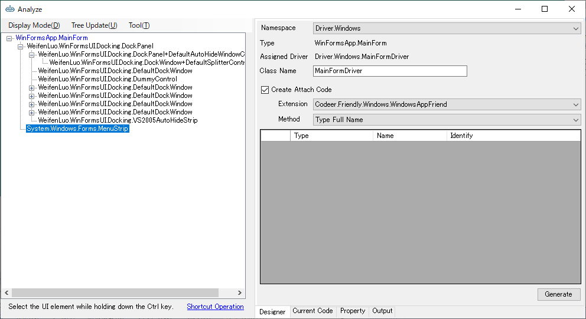
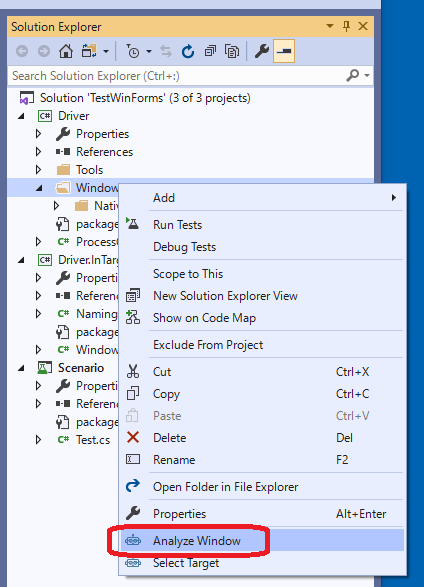
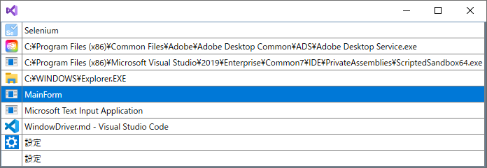
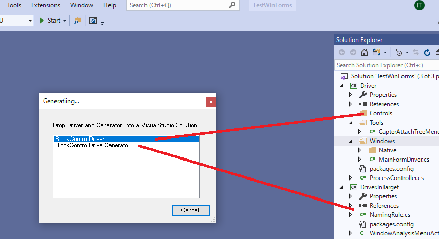

# AnalyzeWindow

AnalyzeWindow は対象のアプリケーションを解析してツリーのルートのコントロールに対してWindowDriverおよびUserControlDriverを作成するものです。
Designer タブの設定をもとにコードを生成します。生成されるコードは Current Code タブでプレビューできます。

WindowDriverとUserControlDriverに関しては[Driver/Scenarioパターン](https://github.com/Codeer-Software/Friendly/blob/master/TestAutomationDesign.jp.md)を参照してください。




## AnalyzeWindowの起動

AnalyzeWindow を起動するにはDriverプロジェクトで生成するコードを配置したいフォルダで右クリックをします。表示されたコンテキストメニューより「Analyze Window」を選択してください。テンプレートではWindowフォルダが生成したコードを配置するフォルダとして定義されています。



テスト対象のアプリケーションを選択する画面が出ますので、対象を選択してください。表示されるアプリケーションは現在起動されているアプリケーションのため、テスト対象のアプリケーションが起動されていない場合は、あらかじめ起動しておく必要があります。

この操作では選択したアプリケーションに対して、解析を行うための処理がインジェクションされます。
間違ったアプリケーションを選択するとOSの再起動が必要になる場合がありますので間違えないように選択してください。



以降、VisualStudioの同一セッション中はこの画面が表示されません。
途中で対象のアプリケーションを変えたい場合はコンテキストメニューで表示される「Select Target」を選択することで対象を変更できます。


## メニュー


| メニュー | 説明 |
|--------|-----|
| Display Mode | |
| - Control | Control.Controls を元にしたツリーを表示します。 |
| - Field | Field を元にしたツリーを表示します。 |
| - Filter Window And UserControl | Form と UserControl のみをツリー上に表示します。 |
| Tree Update | |
| - Auto Update | Tree 自動で更新するかどうかを設定します。通常はONを利用してください。画面の要素が頻繁に更新される場合は動作が重くなるのでチェックをOFFにしてください。 |
| - Update Now | Tree を即時更新します。 |
| - Sync with Visual Studio | AnalyzeWindow 上で選択した要素に対応するドライバコードの行が VisualStudio 上で選択されます。またその逆に VisualStudio 上で行を選択するとAnalyzeWindow 上で対応する要素が選択されます。|
| Tool | |
| - Compile & update | AnalyzeWindow の情報が現在の Visual Stuido のドライバコードをコンパイルしたものに更新されます。 |
| - Option | ツリーに表示するコントロールの種類を選択します。 |

## UI解析ツリー

AnalyzeWindowの左ペインに表示される対象アプリケーションのコントロールがツリー上に表示されているエリアです。
このUI解析ツリーを選択して、WindowDriver/UserControlDriverのプロパティにする対象を決定します。
ツリーで要素を選択することで対象アプリケーションの対応するコントロールが赤枠で囲まれます。
また、Ctrlキーを押しながらアプリケーションのコントロールにマウスオーバーすることでツリーの対応するノードを選択することもできます。


要素をダブルクリックすることで、WindowDriver/UserControlDriverのプロパティとして登録されます。
登録されたコントロールは右ペインのグリッドに追加されます。また、要素を右クリックすることで次のメニューが表示され、操作を行えます。

| メニュー | 説明 |
|--------|-----|
| Change The Analysis Target | 解析対象を現在選択中のノードのUIオブジェクトに変更します。Ctrl+ダブルクリックでも同様の処理を行うことができます。 |
| Pickup | 選択している要素が右側のグリッドに登録されます。 |
| Pickup Children | 指定したコントロールの子孫のコントロールでドライバが割り当たっているものを一括でピックアップしてグリッドに登録します。子孫をたどるときに UserControl を発見した場合、それ以下は検索しません。それ以下のコントロールもグリッドに登録したい場合はそのUserControlを選択し再度 Pickup Children を実行してください。|
| Create Control Driver | コントロールドライバを作成します。 |
| Show Base Class | 選択したコントロールの親クラスをアウトプットウィンドウに表示します。 |
| Expand All | ツリーをすべて開きます。 |
| Close All | ツリーをすべて閉じます。 |
| CodeView | プロジェクト内に対応するソースコードがある場合はVisualStudioで開きます。この時、AnalyzeWindowを開いていない別のVisualStudioでも、VisualStudioのメニュー（ツール - TestAssistantPro - Code Viewer）がチェックされている場合は、そのVisualStudioでもソースコードを開きます。テストプロジェクトと開発用プロジェクトが別のVisualStudioで開かれている場合に便利です。|

右クリックメニューはカスタマイズできます。詳しくは[こちら](CustomizeAnalyzeWindow.md#UI解析ツリーのコンテキストメニューの拡張)

## Designerタブ

右ペインの下段に「Designerタブ」を選択することで表示されます。
作成するWindowDriver/UserControlDriverの構成を設定します。


| 項目 | 説明 |
|-----|-----|
| Type | コントロールのタイプフルネームが表示されます。 |
| Assigned Driver | 割り当たっている Driver のタイプフルネームが表示されます。 |
| Class Name | 作成する WindowDriver/UserControlDriver の名前を指定します。ネームスペースは AnalyzeWindow を表示するときに指定していたフォルダになります。 |
| Create Attach Code | AttachMethod を作るかどうかを指定します。 |
| Extension | Attach する対象のクラスを指定します。 |
| Method | WindowDriver/UserControlDriverをアプリケーションもしくは親のWindowDriver/UserControlDriverから取得する方法です。 <br />- Type Full Name: .Net の TypeFullName で特定します。<br>- Window Text: Win32 の WindowText で特定します。<br />- Variable Window Text: WindowText から特定しますが常に同じ WindowText でない場合に使います。<br>- Custom: カスタムの特定手法です。 |
| グリッド | WindowDriver/UserControlDriver の子要素です。Tree から選択します。 |


Attachに関しては[Attach方法ごとのコード](Attach.md)を参照してください。

## Current Code タブ

右ペインの下段にある「Current Code」タブを選択することで表示されます。
Designer タブでの設定によって出力されるコードが表示されます。
Generateでコードを生成せずにここからコードをコピーして利用することもできます。<br>


## Property タブ

選択しているコントロールのプロパティが表示されます。


#### Target


表示対象が選択できます。チェックがONのクラスのメンバのみ表示されます。

#### Filter
<br>
表示対象が絞り込めます。メンバ名、型名（bool、string等）でフィルタされます。

#### 表示対象種別
<br>
表示対象の種別が指定できます。チェックがONの属性の項目のみ表示されます。

#### コンテキストメニュー
<br>
右クリックすると表示されます。<br>

| 項目 | 説明 |
|--------|-----|
| View Detail | 表示対象を選択されている項目のクラス（または型）へ変更します。<br><br>移動すると上部に「←」ボタンが表示されます。これを押すと1つ上の階層へ戻ります。<br>現在の階層は上部情報表示欄に表示されます。 |
| Add to Driver | 選択されている項目が参照できる場合はドライバへ追加します。<br>結果は「Current Code」タブにて確認できます。 |
| Copy Text | 選択されている項目（Name、Value）をクリップボードへコピーします。Ctrl+Cでも同様の動作が可能です。 |
| View Code | 選択されている項目の値がクラス名で、プロジェクトに登録されている場合はVisualStudio上で開きます。 |


## Outputタブ

メニューによって実行した結果が表示されます。


## Create Control Driver

ControlDriverとCaptureGeneratorのひな型を作成します。Visual Studio 上で格納するフォルダにドロップします。この時ネームスペースはそのフォルダ名が使われます。コードの詳細に関しては[ControlDriverのコード](ControlDriver.md)と[CaptureCodeGeneratorのコード](CaptureCodeGenerator.md)を参照してください。



# デバッグ

これらの WindowDriver/UserControlDriver は、テスト中はもちろん Capture 中にも使われます。
うまくキャプチャできない場合はデバッグして原因を突き止めてください。
Ctrl キーを押しながら Capture するとデバッグできます。
Attach メソッドをカスタマイズした場合などデバッグの必要性が出てくると思います。
ログを出したい場合は Logger を 使えば Capture ウィンドウにログを出力できます。
現在 Capture中なのかどうかは TestAssistantMode を使うと判定できます。
Capture 中だけの処理を書きたい場合に便利です。
WinFormsのDesignModeのイメージで使ってください。

```cs
using Codeer.Friendly;
using Codeer.Friendly.Dynamic;
using Codeer.Friendly.Windows;
using Codeer.Friendly.Windows.Grasp;
using Codeer.TestAssistant.GeneratorToolKit;
using Ong.Friendly.FormsStandardControls;

namespace Driver.Windows
{
    [WindowDriver(TypeFullName = "WinFormsApp.MainForm")]
    public class MainFormDriver
    {
        public WindowControl Core { get; }
        public FormsToolStrip _menuStrip => Core.Dynamic()._menuStrip; 

        public MainFormDriver(WindowControl core)
        {
            Core = core;
        }

        public MainFormDriver(AppVar core)
        {
            Core = new WindowControl(core);
        }
    }

    public static class MainFormDriverExtensions
    {
        [WindowDriverIdentify(TypeFullName = "WinFormsApp.MainForm")]
        public static MainFormDriver AttachMainForm(this WindowsAppFriend app)
        {
            switch (TestAssistantMode.CurrentMode)
            {
                //TestAssistantPro以外で実行
                case TestAssistantMode.Mode.Non:
                    break;
                //AnalyzeWindowから呼ばれた場合
                case TestAssistantMode.Mode.Analyze:
                    break;
                //Captureから呼ばれた場合
                case TestAssistantMode.Mode.Capture:
                    break;
                //Executeから呼ばれた場合
                case TestAssistantMode.Mode.Execute:
                    break;
            }

            //Analyze or Capture から呼ばれた場合に true
            if (TestAssistantMode.IsCreatingMode)
            {
                //ログを出力できる
                Logger.WriteLine("log ....");
            }

            return app.WaitForIdentifyFromTypeFullName("WinFormsApp.MainForm").Dynamic();
        }
    }
}
```


# ネイティブのウィンドウに関して

.Netで実装していても以下のウィンドウはネイティブのものが使われます。

|  Window  |  Driver  |
| ---- | ---- |
| MessageBox | MessageBoxDriver |
| OpenFileDialog | OpenFileDialogDriver |
| SaveFileDialog | SaveFileDialogDriver |
| FolderBrowserDialog | FolderDialogDriver |

これらのドライバは新規作成時、 Driver/Windows/Native 以下に作成されています。

# 生成済みのドライバのメンテナンス

生成済みのドライバに関しては基本は手でメンテナンスになります。プロパティの名前変更などもVisualStudioのリファクタリング機能を使って自由にできます。
ただ コントロールドライバを付け足したい場合やAttach方法を変更したい場合など、AnalyzeWindow を使った方が楽な場合もあります。
そのようなときは、AnalyzeWindowで目的の状態にして Current Code から必要なコードをコピーして元のコードに貼り付けてください。

