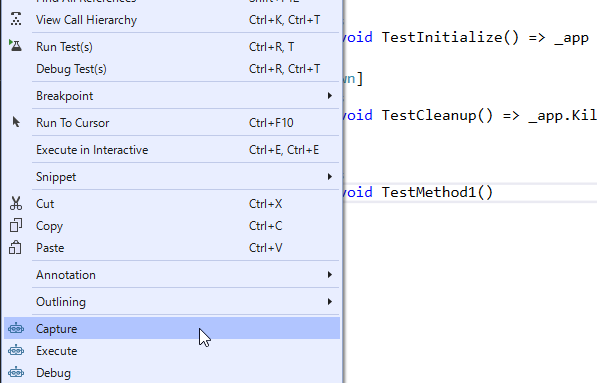
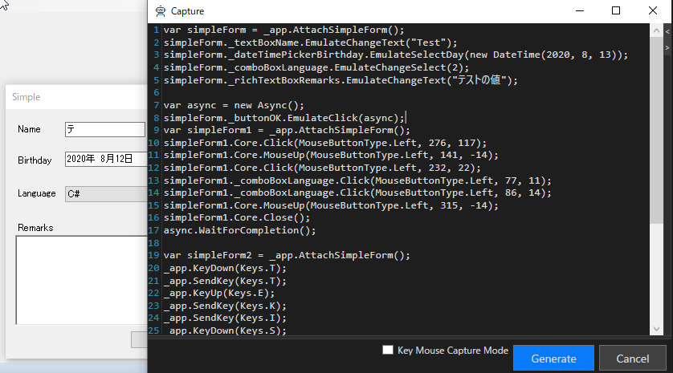
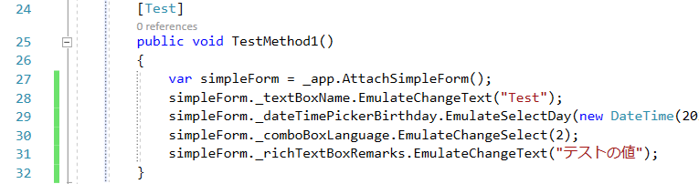
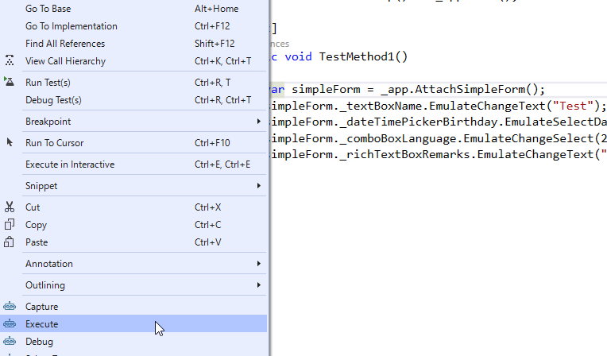

# 画面操作のキャプチャと再生

TestAssistantProには、対になるCaptureとExecuteという機能があります。
<!--TODO ExecuteというよりはReplay?-->

- Capture機能は、アプリケーションの操作をプログラムコードとして記録します。
- Execute機能は、記録したプログラムコードを実行して対象アプリケーション上で操作を再現します。

## Capture

アプリケーションの操作をプログラムコードとして記録します。
Captureでプログラムコードを生成するためには、WindowDriverおよびUserControlDriverが作成されている必要があります。詳細な内容は[AnalyzeWindowの使い方](./AnalyzeWindow.md)を参照してください。

Capture機能を実行するには、プログラムコードを記録したいメソッドを右クリックして、[Capture]を選択してください。Captureウィンドウが表示され、画面操作の記録が開始されます。



この状態で画面操作を行うことで、Captureウィンドウにプログラムコードが追加されていきます。標準の状態では、ControlDriverおよびCaptureCodeGeneratorを利用して、追加するプログラムコードが生成されます。



最後に、[Captureウィンドウ]の[Generate]ボタンをクリックすることで選択したメソッドに生成されたコードが追加されます。




### キーボード操作とマウス操作の記録

Friendly の操作は一般的に最適な操作方法を提供していますが、API呼び出しが基本ですので人の操作とは異なります。
場合によってはより人の操作に近い方が良い場合もあります。
そのような場合は Key Mouse Capture Mode にチェックを入れてください。
その間はより低レベルなキーマウス操作のコードを作成します。
これは Friendly.Windows.KeyMouse を利用したコードになります。
一般的なキーマウス処理よりはタイミングの面で有利です。


### 非同期処理(Async)の出力

モーダルダイアログが出る関数に関しては非同期処理が出力されます。
たとえば メニューの Simple Dialog を実行してダイアログを閉じる処理をキャプチャすると次のようになります。
Async の詳細は[こちら](https://github.com/Codeer-Software/Friendly/blob/master/README.jp.md#async)を参照してください。

```cs
void AsyncTest()
{
    var mainForm = _app.AttachMainForm();

    var async = new Async();
    mainForm._menuStrip.FindItem("etc.", "Simple Dialog").EmulateClick(async);
    var simpleForm = _app.AttachSimpleForm();
    simpleForm._buttonCancel.EmulateClick();
    async.WaitForCompletion();
}
```

### 複数のアプリケーションを操作する

WindowsAppFriend を複数持つ場合は AppInfoAttribute でアプリケーションの名前を指定できます。
これによって Capture 時に変数を使い分けることができます。
ただし複数同時にキャプチャすることはできないので、一つずつキャプチャして処理を作成してください。

```cs
using System.Diagnostics;
using Codeer.Friendly.Windows;
using Driver;
using NUnit.Framework;
using Codeer.TestAssistant.GeneratorToolKit;

namespace Scenario
{
    [TestFixture]
    public class Test
    {
        [AppInfo(Name = "WinFormsApp")]
        WindowsAppFriend _winFormsApp;

        [AppInfo(Name = "WpfApp")]
        WindowsAppFriend _wpfApp;
```

## Execute

記録したプログラムコードを実行して対象アプリケーション上で操作を再現します。

実行したいメソッドを右クリックして、[Execute]を選択してください。プログラムコードが実行され、操作が再生されます。



操作を正しく再生するためにはアプリケーションが操作を実行できる状態になっている必要があります。たとえば、ダイアログの操作を記録したプログラムコードを再生する場合は、ダイアログが表示されている状態から実行する必要があることに注意してください。

### デバッグ

Ctrl キーを押しながらExecuteを実行するとテストプロセスをデバッグできます。
(これは Debug メニューと同じ動作になります)
Shift キーを押しながら Excecute を実行すると対象プロセスをデバッグできます。Dll インジェクションで対象プロセスにロードさせる処理を作っている時に便利です。
Ctrl + Shift を押しながら Execute を実行すると両方を同時にデバッグできます。
