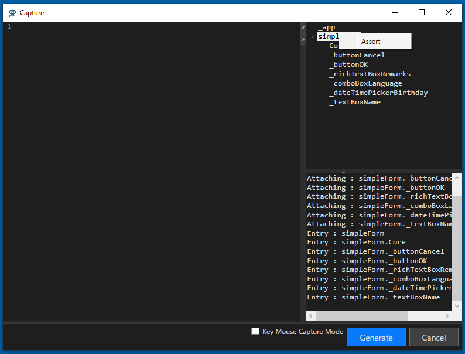
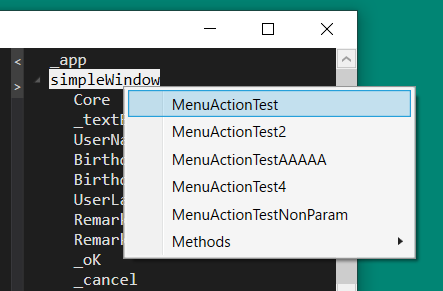
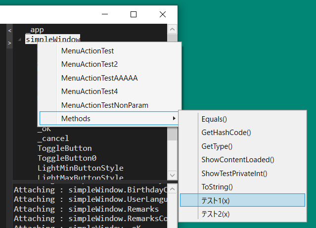
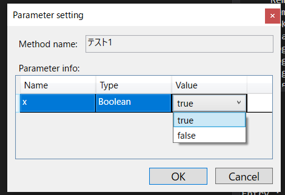

# Captureウィンドウをカスタマイズする

TestAssitantProはCodeer.TestAssistant.GeneratorToolkit に定義されているインタフェースを実装することでその挙動をカスタマイズできます。
ソリューション内で実装および実装されているdllの参照のどちらも利用できます。

## ドライバツリーのコンテキストメニューの拡張

[MenuAction]属性を付けることでドライバツリーに表示されるメニューを拡張できます。
テストソリューションのDriverプロジェクトにある、Tools/CaptureAttachTreeMenuAction.csファイルにはAssertの定義が標準で実装されています。


```cs
using System;
using System.CodeDom;
using System.CodeDom.Compiler;
using System.Collections.Generic;
using System.IO;
using System.Reflection;
using System.Windows.Forms;
using Codeer.Friendly.Windows;
using Codeer.TestAssistant.GeneratorToolKit;
using Ong.Friendly.FormsStandardControls;

namespace Driver.Tools
{
    public static class CapterAttachTreeMenuAction
    {
        [MenuAction]
        public static void Assert(FormsCheckBox checkBox, string accessPath)
        {
            CaptureAdaptor.AddUsing(typeof(CheckState).Namespace);
            CaptureAdaptor.AddCode($"{accessPath}.CheckState.Is(CheckState.{checkBox.CheckState});");
        }

        [MenuAction]
        public static void Assert(FormsCheckedListBox checkedListBox, string accessPath)
        {
            var count = checkedListBox.ItemCount;
            for (int i = 0; i < count; i++)
            {
                var checkState = checkedListBox.GetCheckState(i);
                CaptureAdaptor.AddCode($"{accessPath}.GetCheckState({i}).Is(CheckState.{checkState});");
            }
        }

        [MenuAction]
        public static void Assert(FormsComboBox comboBox, string accessPath)
            => CaptureAdaptor.AddCode($"{accessPath}.SelectedItemIndex.Is({comboBox.SelectedItemIndex});");

        [MenuAction]
        public static void Assert(FormsDataGridView dataGridView, string accessPath)
        {
            var rowCount = dataGridView.RowCount;
            var colCount = dataGridView.ColumnCount;
            for (int row = 0; row < rowCount; row++)
            {
                for (int col = 0; col < colCount; col++)
                {
                    var text = ToLiteral(dataGridView.GetCell(col, row).Text);
                    CaptureAdaptor.AddCode($"{accessPath}.GetCell({col}, {row}).Text.Is({text});");
                }
            }
        }

        [MenuAction]
        public static void Assert(FormsDateTimePicker dateTimePicker, string accessPath)
        {
            CaptureAdaptor.AddUsing(typeof(DateTime).Namespace);
            var value = dateTimePicker.SelectedDay;
            CaptureAdaptor.AddCode($"{accessPath}.SelectedDay.Date.Is(new DateTime({value.Year}, {value.Month}, {value.Day}));");
        }

        [MenuAction]
        public static void Assert(FormsListBox listBox, string accessPath)
        {
            var texts = listBox.GetAllItemText();
            for (int i = 0; i < texts.Length; i++)
            {
                CaptureAdaptor.AddCode($"{accessPath}.GetItemText({i}).Is({ToLiteral(listBox.GetItemText(i))});");
            }
        }

        [MenuAction]
        public static void Assert(FormsListView listView, string accessPath)
        {
            var rowCount = listView.ItemCount;
            var colCount = listView.ColumnCount;
            for (int row = 0; row < rowCount; row++)
            {
                for (int col = 0; col < colCount; col++)
                {
                    var text = ToLiteral(listView.GetListViewItem(row).GetSubItem(col).Text);
                    CaptureAdaptor.AddCode($"{accessPath}.GetListViewItem({row}).GetSubItem({col}).Text.Is({text});");
                }
            }
        }

        [MenuAction]
        public static void Assert(FormsMaskedTextBox maskedTextBox, string accessPath)
            => CaptureAdaptor.AddCode($"{accessPath}.Text.Is({ToLiteral(maskedTextBox.Text)});");

        [MenuAction]
        public static void Assert(FormsMonthCalendar monthCalendar, string accessPath)
        {
            CaptureAdaptor.AddUsing(typeof(DateTime).Namespace);
            var value = monthCalendar.SelectedDay;
            CaptureAdaptor.AddCode($"{accessPath}.SelectedDay.Date.Is(new DateTime({value.Year}, {value.Month}, {value.Day}));");
        }

        [MenuAction]
        public static void Assert(FormsNumericUpDown numericUpDown, string accessPath)
            => CaptureAdaptor.AddCode($"{accessPath}.Value.Is({numericUpDown.Value});");

        [MenuAction]
        public static void Assert(FormsProgressBar progressBar, string accessPath)
            => CaptureAdaptor.AddCode($"{accessPath}.Pos.Is({progressBar.Pos});");

        [MenuAction]
        public static void Assert(FormsRadioButton radioButton, string accessPath)
            => CaptureAdaptor.AddCode($"{accessPath}.Checked.Is({radioButton.Checked.ToString().ToLower()});");

        [MenuAction]
        public static void Assert(FormsRichTextBox richTextBox, string accessPath)
            => CaptureAdaptor.AddCode($"{accessPath}.Text.Is({ToLiteral(richTextBox.Text)});");

        [MenuAction]
        public static void Assert(FormsTabControl tabControl, string accessPath)
            => CaptureAdaptor.AddCode($"{accessPath}.SelectedIndex.Is({tabControl.SelectedIndex});");

        [MenuAction]
        public static void Assert(FormsTextBox textBox, string accessPath)
            => CaptureAdaptor.AddCode($"{accessPath}.Text.Is({ToLiteral(textBox.Text)});");

        [MenuAction]
        public static void Assert(FormsToolStripComboBox toolStripComboBox, string accessPath)
            => CaptureAdaptor.AddCode($"{accessPath}.ComboBox.SelectedItemIndex.Is({toolStripComboBox.ComboBox.SelectedItemIndex});");

        [MenuAction]
        public static void Assert(FormsToolStripTextBox toolStripTextBox, string accessPath)
            => CaptureAdaptor.AddCode($"{accessPath}.Text.Is({ToLiteral(toolStripTextBox.Text)});");

        [MenuAction]
        public static void Assert(FormsTrackBar trackBar, string accessPath)
            => CaptureAdaptor.AddCode($"{accessPath}.Value.Is({trackBar.Value});");

        [MenuAction]
        public static void Assert(FormsTreeView treeView, string accessPath)
        {
            if (treeView.SelectNode.AppVar.IsNull)
            {
                CaptureAdaptor.AddCode($"{accessPath}.SelectNode.AppVar.IsNull.IsTrue();");
            }
            else
            {
                CaptureAdaptor.AddCode($"{accessPath}.SelectNode.Text.Is({ToLiteral(treeView.SelectNode.Text)});");
            }
        }

        static string ToLiteral(string text)
        {
            using (var writer = new StringWriter())
            using (var provider = CodeDomProvider.CreateProvider("CSharp"))
            {
                var expression = new CodePrimitiveExpression(text);
                provider.GenerateCodeFromExpression(expression, writer, options: null);
                return writer.ToString();
            }
        }
    }
}
```



### MenuActionの指定方法

#### staticの場合
```cs
    [MenuAction]
    public static void MenuActionTest(SimpleWindowDriver driver, string accessPath)
    {
    }

    [MenuAction]
    public static void MenuActionTestNonParam(SimpleWindowDriver driver)
    {
    }
```
staticの場合は上記Assertと同様に、第1引数はそのクラスのオブジェクトとなります。<br>
第2引数には「string accessPath」と指定することで、アクセスパスを指定することができます（省略可）。

#### メンバの場合
```cs
    [MenuAction]
    public void MenuActionTest2()
    {
    }

    [MenuAction(DisplayName="MenuActionTestAAAAA")]
    public void MenuActionTest3(string accessPath)
    {
    }

    [MenuAction]
    public void MenuActionTest4(string accessPath)
    {
    }
```
メンバとして指定する場合は、第1引数は「string accessPath」を指定することができます（省略可）。<br>
他の引数を指定した場合はエラーとなりメニューへの表示はされません。<br>
また、属性のパラメータとして「DisplayName」を指定することで、メニューでの表示名を変更することができます。<br>

正しく記述することで、右クリックメニューにメソッドが表示されます。<br>
<br>

MenuAction属性が付いたメソッドは、上記Assertのように「CaptureAdaptor.AddCode」等を記述しない限り、実行されるだけでキャプチャされたコードが出力されることはありません。

### メソッドの実行
<br>
対象となるオブジェクトのpublicメソッドが「Methods」項目に一覧表示されます。<br>
ドライバのクラスでpublicメソッドを書くことで、独自の処理を呼び出すことができます。

```cs
    public void テスト1(bool x)
    {
    }

    public enum XXX
    {
        A,
        B
    }

    public void テスト2(XXX x)
    {
    }
```
引数にはstring、bool、Enum、int等の数値型を指定することができます（対応外の引数が指定されている場合はメニューに表示されません）。<br>
実行時、引数が指定されている場合は入力用のダイアログが表示されます。<br>
<br>
