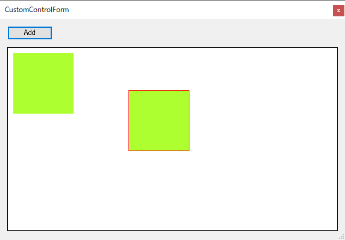
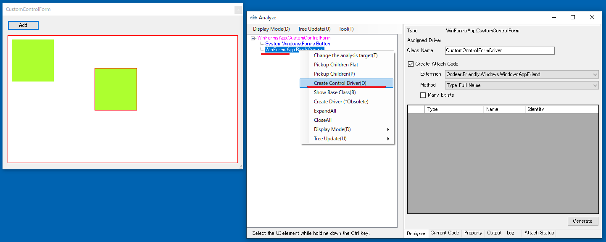
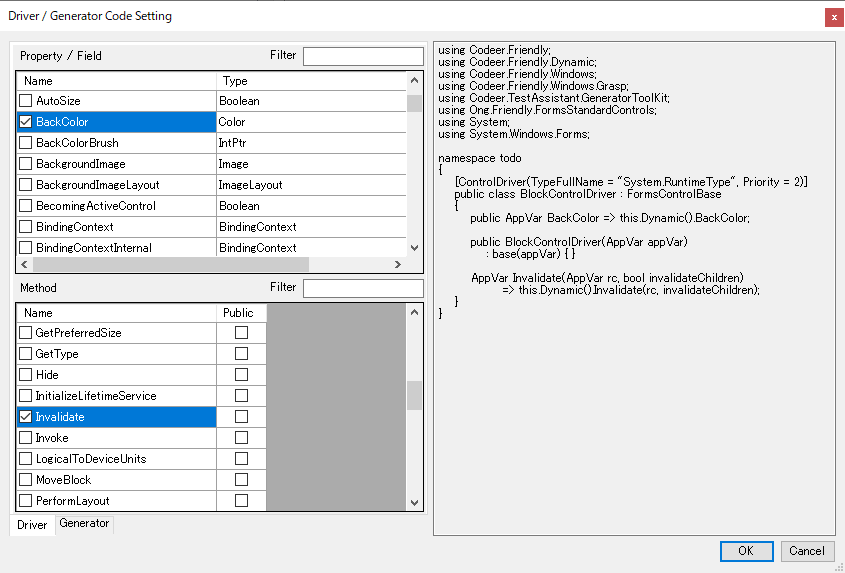
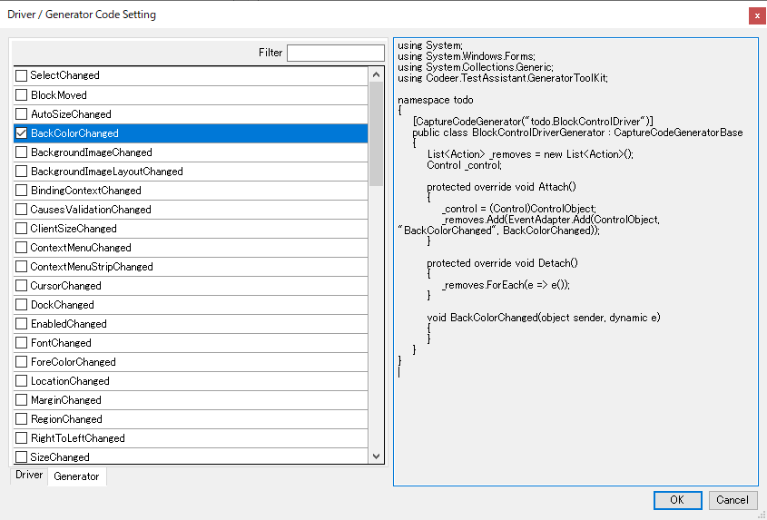
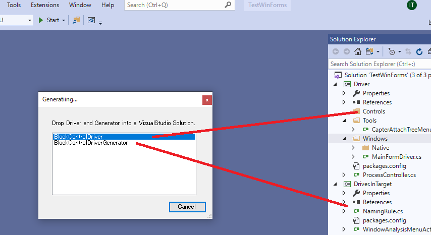

# ControlDriverとCaptureCodeGeneratorを作成する

ここではサンプルとしてBlockControlのControlDriverとCaptureCodeGeneratorを作成します。
MainFrameのメニューから[etc]-[Custom Control Dialog]選択して、[CustomControlDialog]を表示してください。
このダイアログではAddボタンを押すことでブロックが画面上に追加されます。
BlockControlはブロックをドラッグで移動させることができます。

## ControlDriverとCaptureCodeGeneratorのコードテンプレートを生成する

最初にAnalyzeWindowを使ってControlDriverのコードテンプレートを作成します。
UI解析ツリーからBlockControlを選択し、コンテキスメニューより[Create Control Driver]を選択してください。

ダイアログから ControlDriver に、どのプロパティ、フィールド、メソッドを追加するかを選択できます。

タブを Generator にすると CaptureCodeGenerator に、どのイベントを追加するかを選択できます。

OKボタンを押すと生成する ControlDriver や CaptureGenerator をドロップするダイアログが表示されます。
ダイアログから ControlDriver を選択し Driver プロジェクトの任意のフォルダにドロップします。
どこでも良いのですが、今回は Controls というフォルダを作ってそこにドロップしました。
次に CaptureGenerator を選択し Driver.InTarget の任意のフォルダにドロップします。

## 次の手順
[ControlDriverとCaptureCodeGeneratorのコードテンプレートを生成する](ControlDriver1.md)
