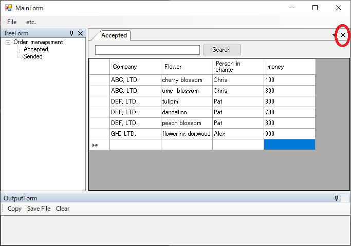

### DockContentの閉じるに反応するようにする

DockContentも標準のコントロールではないのでそのままでは対応できません。
こちらも同様に作成してみます。
作成後にDockContentを継承したウィンドウに対してドライバを作るとCoreの部分がDockContentDriverになります。
演習の順番的に先ほどすでに作っている場合は、手動でWindowControlの部分を書き換えてください。



```cs
using Codeer.Friendly;
using Codeer.TestAssistant.GeneratorToolKit;
using Ong.Friendly.FormsStandardControls;

namespace Driver.Controls
{
    [ControlDriver(TypeFullName = "WeifenLuo.WinFormsUI.Docking.DockContent", Priority = 2)]
    public class DockContentDriver : FormsControlBase
    {
        public DockContentDriver(AppVar appVar)
            : base(appVar) { }
    }
}
```

```cs
using System.Windows.Forms;
using Codeer.TestAssistant.GeneratorToolKit;

namespace Driver.InTarget
{
    [CaptureCodeGenerator("Driver.Controls.DockContentDriver")]
    public class DockContentDriverGenerator : CaptureCodeGeneratorBase
    {
        Form _control;

        protected override void Attach()
        {
            _control = (Form)ControlObject;
            _control.FormClosed += FormClosed;
        }

        protected override void Detach()
        {
            _control.FormClosed -= FormClosed;
        }

        void FormClosed(object sender, FormClosedEventArgs e)
        {
            AddSentence(new TokenName(), ".Close();");
        }
    }
}
```

```cs
[UserControlDriver(TypeFullName = "WinFormsApp.OrderDocumentForm")]
public class OrderDocumentFormDriver
{
    //WindowControl -> DockContentDriver
    public DockContentDriver Core { get; }

    public FormsButton _searchButton => Core.Dynamic()._searchButton;
    public FormsTextBox _searchTextBox => Core.Dynamic()._searchTextBox;
    public FormsDataGridView _grid => Core.Dynamic()._grid;

    public OrderDocumentFormDriver(WindowControl core)
    {
        Core = new DockContentDriver(core.AppVar);
    }

    public OrderDocumentFormDriver(AppVar core)
    {
        Core = new DockContentDriver(core);
    }
}
```

## 次の手順

ここまで画面キャプチャを行うためのすべての処理が完了しました。
次は実際に画面をキャプチャしてシナリオを作成します。

[アプリケーションを操作してシナリオを作成する](Scenario.md)