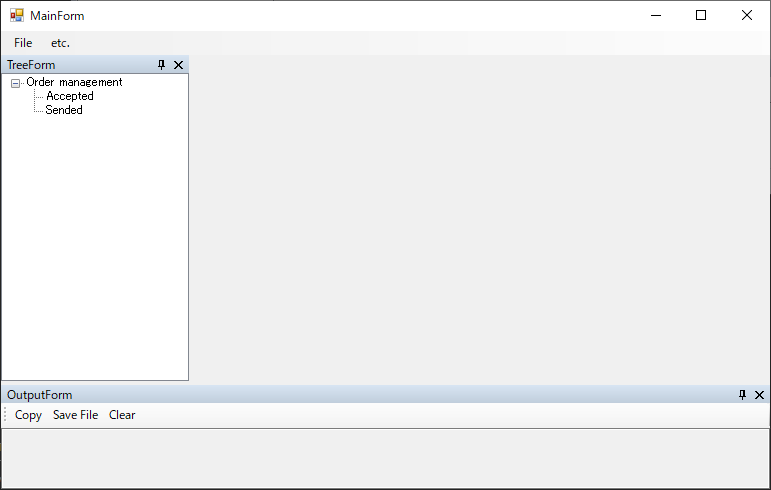

# アプリケーションを解析してWindowDriverおよびUserControlDriverを作成する

[テストソリューションを新規作成する](./Sln.md)で作成したソリューションにTestAssistantProを利用してアプリケーションのドライバを作ります。

この手順を始める前に、ドライバの概要を理解するために、
[Driver/Scenarioパターン](https://github.com/Codeer-Software/Friendly/blob/master/TestAutomationDesign.jp.md)
を参照しておいてください。

各機能の詳細な内容は次を参照してください。

- [AnalyzeWindowによるアプリケーションの解析](../feature/AnalyzeWindow.md)
- [AnalyzeWindowで生成されるコード](../feature/GeneratedCode.md)
- [Attach方法ごとのコード](../feature/Attach.md)

## 事前準備
WinFormsApp.exeを起動してください。ドライバの作成は操作対象のアプリケーションを解析しながら行います。

## 次の手順
[AnalzeWindowの表示](WindowDriver1.md)