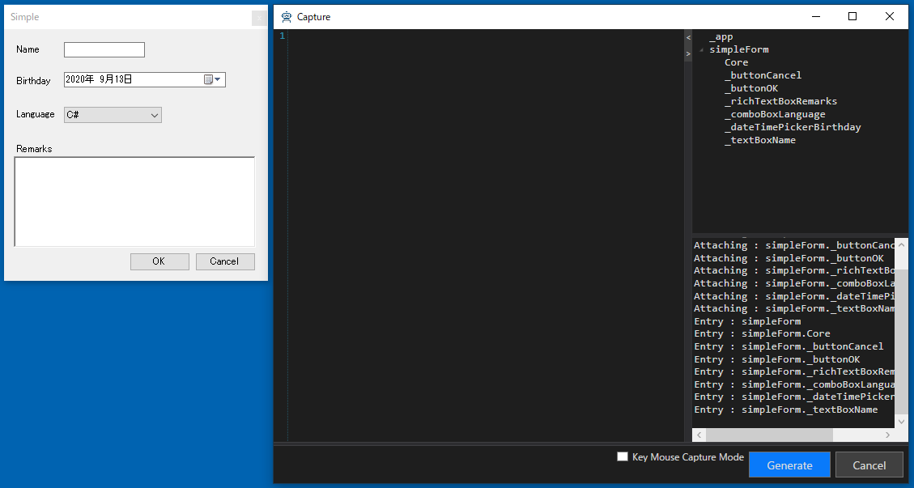
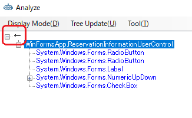

# アプリケーションを解析してWindowDriverおよびUserControlDriverを作成する

[テストソリューションを新規作成する](./Sln.md)で作成したソリューションにTestAssistantProを利用してアプリケーションのドライバを作ります。

この手順を始める前に、ドライバの概要を理解するために、
[Driver/Scenarioパターン](https://github.com/Codeer-Software/Friendly/blob/master/TestAutomationDesign.jp.md)
を参照しておいてください。

各機能の詳細な内容は次を参照してください。

- [AnalyzeWindowによるアプリケーションの解析](../feature/AnalyzeWindow.md)
- [AnalyzeWindowで生成されるコード](../feature/GeneratedCode.md)
- [Attach方法ごとのコード](../feature/Attach.md)

## 事前準備
WinFormsApp.exeを起動してください。ドライバの作成は操作対象のアプリケーションを解析しながら行います。

## AnalzeWindowの表示

ソリューションエクスプローラーのDriverプロジェクトのWindowsフォルダで右クリックしてAnalyze Windowを実行します。


テスト対象のアプリケーションを選択する画面が出ますので、MainFormを選択してください。（ダブルクリックもしくは選択状態にしてからEnterキー押下で選択できます）


詳細は「[AnalyzeWindow/AnalyzeWindowの起動](../feature/AnalyzeWindow.md#AnalyzeWindowの起動)」を参照してください。

## Simple Dialogのドライバの作成

まずはシンプルなダイアログで操作に慣れていきます。
対象アプリケーションのMainFrameのメニューから[etc] - [Simple Dialog]を選択して、ダイアログを表示します。
ダイアログが表示されるAnalyzeWindowは自動的にその内容を読み取りUI解析ツリーを更新します。


UI解析ツリーのルートで右クリックメニューを表示して[Pickup Children]を実行します。
そうするとグリッドに ControlDriver の割り当たった要素がピックアップされます。

- 名前はデフォルトでは変数名になっていますが、変更できます。
- ラベルは Pickup Chidlren では無視されますが、必要ならツリーの要素をダブルクリックすることにより追加で登録できます。

必要な要素を登録したら[Generate]ボタンを押してコードを生成します。
[Create Attach Code]はデフォルトの状態で生成してください。


"Generated"と記載されたメッセージボックスが表示され、[Windows]フォルダの下にファイルが生成されます。
コードの詳細は[AnalyzeWindowで生成されるコード](../feature/GeneratedCode.md)と[Attach方法ごとのコード](../feature/Attach.md)を参照してください。
```cs
using Codeer.Friendly;
using Codeer.Friendly.Dynamic;
using Codeer.Friendly.Windows;
using Codeer.Friendly.Windows.Grasp;
using Codeer.TestAssistant.GeneratorToolKit;
using Ong.Friendly.FormsStandardControls;

namespace Driver.Windows
{
    [WindowDriver(TypeFullName = "WinFormsApp.SimpleForm")]
    public class SimpleFormDriver
    {
        public WindowControl Core { get; }
        public FormsButton _buttonCancel => Core.Dynamic()._buttonCancel; 
        public FormsButton _buttonOK => Core.Dynamic()._buttonOK; 
        public FormsRichTextBox _richTextBoxRemarks => Core.Dynamic()._richTextBoxRemarks; 
        public FormsComboBox _comboBoxLanguage => Core.Dynamic()._comboBoxLanguage; 
        public FormsDateTimePicker _dateTimePickerBirthday => Core.Dynamic()._dateTimePickerBirthday; 
        public FormsTextBox _textBoxName => Core.Dynamic()._textBoxName; 

        public SimpleFormDriver(WindowControl core)
        {
            Core = core;
        }

        public SimpleFormDriver(AppVar core)
        {
            Core = new WindowControl(core);
        }
    }

    public static class SimpleFormDriverExtensions
    {
        [WindowDriverIdentify(TypeFullName = "WinFormsApp.SimpleForm")]
        public static SimpleFormDriver AttachSimpleForm(this WindowsAppFriend app)
            => app.WaitForIdentifyFromTypeFullName("WinFormsApp.SimpleForm").Dynamic();
    }
}
```

次に画面操作を行い、生成したドライバを使ったテストコードを生成します。
Analyze Window を閉じて Scenario/Test.csのTestMethod1で右クリックして表示されたコンテキストメニューから[Capture]を選択してください。


[Capture]ウィンドウが表示されたら、Simple Dialogを操作して、内容を記録します。最後に[Generate]ボタンをクリックして、コードを生成します。


選択していたテストメソッドにコードが挿入されていることを確認してください。

## 少しづつ確認しながら作成する
上記の例のようにドライバを作成したら、キャプチャできるか確認してください。
特に最初のうちは少しづつ作業を進めることが重要です。
問題があれば[デバッグし](../feature/CaptureAndExecute.md#デバッグ)ながらキャプチャをしてみて問題を突き止めてください。
また、CaptureウィンドウのAttachツリーも役に立ちます。現在アタッチされているWindowが表示されます。



## Multi UserControl Dialogのドライバの作成

次は2つのUserContorlが含まれているMultiUserControlFormのドライバを作成します。
対象アプリケーションのMainFrameのメニューから[etc] - [Multi UserControl Dialog]を選択して、ダイアログを表示します。


最初に右側のUserControlのドライバを作りみます。
ツリー上で[ReservationInformationUserControl]を選択し、右クリックから[Change The Analysis Target]を選択します。
解析対象が切り替わり、UI解析ツリーおよびDesignerタブの内容が[ReservationInformationUserControl]を起点にした内容で置き換わります。
必要なコントロールを Designer に登録して Generate ボタンでコードを生成します。


```cs
using Codeer.Friendly;
using Codeer.Friendly.Dynamic;
using Codeer.Friendly.Windows.Grasp;
using Codeer.TestAssistant.GeneratorToolKit;
using Ong.Friendly.FormsStandardControls;

namespace Driver.Windows
{
    [UserControlDriver(TypeFullName = "WinFormsApp.ReservationInformationUserControl")]
    public class ReservationInformationUserControlDriver
    {
        public WindowControl Core { get; }
        public FormsRadioButton _radioButtonAlacarte => Core.Dynamic()._radioButtonAlacarte; 
        public FormsRadioButton _radioButtonCourse => Core.Dynamic()._radioButtonCourse; 
        public FormsNumericUpDown numericUpDown1 => Core.Dynamic().numericUpDown1; 
        public FormsCheckBox _checkBoxSmoking => Core.Dynamic()._checkBoxSmoking; 

        public ReservationInformationUserControlDriver(WindowControl core)
        {
            Core = core;
        }

        public ReservationInformationUserControlDriver(AppVar core)
        {
            Core = new WindowControl(core);
        }
    }
}
```
解析対象を親ウィンドウ戻すにはツリーのルートの[←]をダブルクリックするか、そこを右クリックで[Change The Analysis Target]を選択します。



次に左側のUserControlに対するコードを生成します。今回はドライバを作成せずFormに直接UserControlの要素を配置します。
UserControlDriverを作るか親のWindowDriverに直接配置するかはそのときどきで判断してください。ダイアログで常に表示されているUserControlである並ば親のWindowDriverに直接配置しても良い場合が多いです。
UI解析ツリーの[ChangeOfPartyUserControl]の下に表示されている2つのテキストボックスをダブルクリックしてDesignerタブのグリッドに追加してください。
またReservationInformationUserControlも追加してください。先ほど作ったReservationInformationUserControlDriverが割り当たります。


[Generate]ボタンをクリックしてコードを生成します。

```cs
using Codeer.Friendly;
using Codeer.Friendly.Dynamic;
using Codeer.Friendly.Windows;
using Codeer.Friendly.Windows.Grasp;
using Codeer.TestAssistant.GeneratorToolKit;
using Ong.Friendly.FormsStandardControls;

namespace Driver.Windows
{
    [WindowDriver(TypeFullName = "WinFormsApp.MultiUserControlForm")]
    public class MultiUserControlFormDriver
    {
        public WindowControl Core { get; }
        public ReservationInformationUserControlDriver reservationInformationUserControl1
             => new ReservationInformationUserControlDriver(Core.Dynamic().reservationInformationUserControl1); 
        public FormsTextBox _textBoxTel => Core.Dynamic().chargeOfPartyUserControl1._textBoxTel; 
        public FormsTextBox _textBoxName => Core.Dynamic().chargeOfPartyUserControl1._textBoxName; 

        public MultiUserControlFormDriver(WindowControl core)
        {
            Core = core;
        }

        public MultiUserControlFormDriver(AppVar core)
        {
            Core = new WindowControl(core);
        }
    }

    public static class MultiUserControlFormDriverExtensions
    {
        [WindowDriverIdentify(TypeFullName = "WinFormsApp.MultiUserControlForm")]
        public static MultiUserControlFormDriver AttachMultiUserControlForm(this WindowsAppFriend app)
            => app.WaitForIdentifyFromTypeFullName("WinFormsApp.MultiUserControlForm").Dynamic();
    }
}
```

## MainFormのドライバの作成

MainForm は複数のドッキングウィンドウで構成されています。ここでは MainForm はメニューだけを持つウィンドウと考えます。残りのTreeFormやOutputFormはUserControlをAttach形式で作成します。（のちほど説明します）
メニューだけをプロパティに追加して、ドライバを生成してください。


```cs
using Codeer.Friendly;
using Codeer.Friendly.Dynamic;
using Codeer.Friendly.Windows;
using Codeer.Friendly.Windows.Grasp;
using Codeer.TestAssistant.GeneratorToolKit;
using Ong.Friendly.FormsStandardControls;

namespace Driver.Windows
{
    [WindowDriver(TypeFullName = "WinFormsApp.MainForm")]
    public class MainFormDriver
    {
        public WindowControl Core { get; }
        public FormsToolStrip _menuStrip => Core.Dynamic()._menuStrip; 

        public MainFormDriver(WindowControl core)
        {
            Core = core;
        }

        public MainFormDriver(AppVar core)
        {
            Core = new WindowControl(core);
        }
    }

    public static class MainFormDriverExtensions
    {
        [WindowDriverIdentify(TypeFullName = "WinFormsApp.MainForm")]
        public static MainFormDriver AttachMainForm(this WindowsAppFriend app)
            => app.WaitForIdentifyFromTypeFullName("WinFormsApp.MainForm").Dynamic();
    }
}
```

## TreeFormとOutputFormのドライバの作成

TreeForm と OutputForm は UserControlDriver として作成します。
これはAttach方式にします。
Attach対象は MainFromDriver ではなく WindowsAppFrined (アプリケーション全体)にします。
これはフローティング状態にするなどさまざまな状態を作ることができるからです。

まずは TreeForm の UserControlDriver を作ります。
Ctrlキーを押しながらMainFormのTreeにマウスオーバーすることでTreeViewがUI解析ツリーで選択状態になります。
AnalyzeWindowのTree上で一つ上の要素にTreeFormがあるので、選択してコンテキストメニューより[Change The Analysis Target]を選択します。
TreeFormの子要素であるTreeViewをダブルクリックしてプロパティに追加します。

Designerタブの内容を次のように変更し、[Generate]ボタンをクリックしてコードを生成します。
記載されている内容以外はデフォルトのままにしておきます。

| 項目 | 設定内容 |
|-----|--------|
| Create Attach Code | チェックをつける |
| Extension | WindowAppFriend |

このオプションの詳細は [Attach方法ごとのコード](../feature/Attach.md)を参照してください。


```cs
using Codeer.Friendly;
using Codeer.Friendly.Dynamic;
using Codeer.Friendly.Windows;
using Codeer.Friendly.Windows.Grasp;
using Codeer.TestAssistant.GeneratorToolKit;
using Ong.Friendly.FormsStandardControls;
using System.Linq;

namespace Driver.Windows
{
    [UserControlDriver(TypeFullName = "WinFormsApp.TreeForm")]
    public class TreeFormDriver
    {
        public WindowControl Core { get; }
        public FormsTreeView _treeView => Core.Dynamic()._treeView; 

        public TreeFormDriver(WindowControl core)
        {
            Core = core;
        }

        public TreeFormDriver(AppVar core)
        {
            Core = new WindowControl(core);
        }
    }

    public static class TreeFormDriverExtensions
    {
        [UserControlDriverIdentify()]
        public static TreeFormDriver AttachTreeForm(this WindowsAppFriend app)
            => app.GetTopLevelWindows().SelectMany(e => e.GetFromTypeFullName("WinFormsApp.TreeForm")).FirstOrDefault()?.Dynamic();
    }
}
```

OutputForm も同様に作成してください。

```cs
using Codeer.Friendly;
using Codeer.Friendly.Dynamic;
using Codeer.Friendly.Windows;
using Codeer.Friendly.Windows.Grasp;
using Codeer.TestAssistant.GeneratorToolKit;
using Ong.Friendly.FormsStandardControls;
using System.Linq;

namespace Driver.Windows
{
    [UserControlDriver(TypeFullName = "WinFormsApp.OutputForm")]
    public class OutputFormDriver
    {
        public WindowControl Core { get; }
        public FormsTextBox _textBoxResult => Core.Dynamic()._textBoxResult; 
        public FormsToolStrip _toolStrip => Core.Dynamic()._toolStrip; 

        public OutputFormDriver(WindowControl core)
        {
            Core = core;
        }

        public OutputFormDriver(AppVar core)
        {
            Core = new WindowControl(core);
        }
    }

    public static class OutputFormDriverExtensions
    {
        [UserControlDriverIdentify()]
        public static OutputFormDriver AttachOutputForm(this WindowsAppFriend app)
            => app.GetTopLevelWindows().SelectMany(e => e.GetFromTypeFullName("WinFormsApp.OutputForm")).FirstOrDefault()?.Dynamic();
    }
}
```

## Documentのドライバの作成
Document は TreeView の AcceptedもしくはSendedから開くことができます。これは同じクラスで表示するデータが異なっているだけです。一般的にドキュメントは同じタイプのものが複数存在します。
Attach方法は VariableWindowText を利用し、 WindowsAppFriend にAttachするように設定します。
Attachのオプションの詳細は [Attach方法ごとのコード](../feature/Attach.md)を参照してください。


```cs
using Codeer.Friendly;
using Codeer.Friendly.Dynamic;
using Codeer.Friendly.Windows;
using Codeer.Friendly.Windows.Grasp;
using Codeer.TestAssistant.GeneratorToolKit;
using Ong.Friendly.FormsStandardControls;
using System.Linq;

namespace Driver.Windows
{
    [UserControlDriver(TypeFullName = "WinFormsApp.OrderDocumentForm")]
    public class OrderDocumentFormDriver
    {
        public WindowControl Core { get; }
        public FormsButton _searchButton => Core.Dynamic()._searchButton;
        public FormsTextBox _searchTextBox => Core.Dynamic()._searchTextBox;
        public FormsDataGridView _grid => Core.Dynamic()._grid;

        public OrderDocumentFormDriver(WindowControl core)
        {
            Core = core;
        }

        public OrderDocumentFormDriver(AppVar core)
        {
            Core = new WindowControl(core);
        }
    }

    public static class OrderDocumentFormDriverExtensions
    {
        [UserControlDriverIdentify(CustomMethod = "TryGet")]
        public static OrderDocumentFormDriver AttachOrderDocumentForm(this WindowsAppFriend app, string text)
            => app.GetTopLevelWindows().SelectMany(e=>e.GetFromTypeFullName("WinFormsApp.OrderDocumentForm")).Where(e=>(string)e.Dynamic().Text == text).FirstOrDefault()?.Dynamic();

        public static void TryGet(this WindowsAppFriend parent, out string[] texts)
            => texts = parent.GetTopLevelWindows().SelectMany(e => e.GetFromTypeFullName("WinFormsApp.OrderDocumentForm")).Select(e => (string)e.Dynamic().Text).ToArray();

    }
}
```

## 次の手順

ここまで画面キャプチャを行うためのドライバの作成が完了しました。
次は標準ではキャプチャに対応していないコントロールに対応するためのControlDriverを作成します。

[ControlDriverとCaptureCodeGeneratorを作成する](ControlDriver.md)