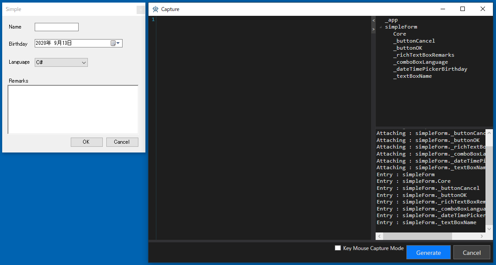

## Simple Dialogのドライバの作成

まずはシンプルなダイアログで操作に慣れていきます。
対象アプリケーションのMainFrameのメニューから[etc] - [Simple Dialog]を選択して、ダイアログを表示します。
ダイアログが表示されるAnalyzeWindowは自動的にその内容を読み取りUI解析ツリーを更新します。


UI解析ツリーのルートで右クリックメニューを表示して[Pickup Children]を実行します。
そうするとグリッドに ControlDriver の割り当たった要素がピックアップされます。

- 名前はデフォルトでは変数名になっていますが、変更できます。
- ラベルは Pickup Chidlren では無視されますが、必要ならツリーの要素をダブルクリックすることにより追加で登録できます。

必要な要素を登録したら[Generate]ボタンを押してコードを生成します。
[Create Attach Code]はデフォルトの状態で生成してください。


"Generated"と記載されたメッセージボックスが表示され、[Windows]フォルダの下にファイルが生成されます。
コードの詳細は[AnalyzeWindowで生成されるコード](../feature/GeneratedCode.md)と[Attach方法ごとのコード](../feature/Attach.md)を参照してください。
```cs
using Codeer.Friendly;
using Codeer.Friendly.Dynamic;
using Codeer.Friendly.Windows;
using Codeer.Friendly.Windows.Grasp;
using Codeer.TestAssistant.GeneratorToolKit;
using Ong.Friendly.FormsStandardControls;

namespace Driver.Windows
{
    [WindowDriver(TypeFullName = "WinFormsApp.SimpleForm")]
    public class SimpleFormDriver
    {
        public WindowControl Core { get; }
        public FormsButton _buttonCancel => Core.Dynamic()._buttonCancel; 
        public FormsButton _buttonOK => Core.Dynamic()._buttonOK; 
        public FormsRichTextBox _richTextBoxRemarks => Core.Dynamic()._richTextBoxRemarks; 
        public FormsComboBox _comboBoxLanguage => Core.Dynamic()._comboBoxLanguage; 
        public FormsDateTimePicker _dateTimePickerBirthday => Core.Dynamic()._dateTimePickerBirthday; 
        public FormsTextBox _textBoxName => Core.Dynamic()._textBoxName; 

        public SimpleFormDriver(WindowControl core)
        {
            Core = core;
        }

        public SimpleFormDriver(AppVar core)
        {
            Core = new WindowControl(core);
        }
    }

    public static class SimpleFormDriverExtensions
    {
        [WindowDriverIdentify(TypeFullName = "WinFormsApp.SimpleForm")]
        public static SimpleFormDriver AttachSimpleForm(this WindowsAppFriend app)
            => app.WaitForIdentifyFromTypeFullName("WinFormsApp.SimpleForm").Dynamic();
    }
}
```

次に画面操作を行い、生成したドライバを使ったテストコードを生成します。
Analyze Window を閉じて Scenario/Test.csのTestMethod1で右クリックして表示されたコンテキストメニューから[Capture]を選択してください。


[Capture]ウィンドウが表示されたら、Simple Dialogを操作して、内容を記録します。最後に[Generate]ボタンをクリックして、コードを生成します。


選択していたテストメソッドにコードが挿入されていることを確認してください。

## 少しずつ確認しながら作成する

上記の例のようにドライバを作成したら、キャプチャできるか確認してください。
特に最初のうちは少しずつ作業を進めることが重要です。
問題があれば[デバッグし](../feature/CaptureAndExecute.md#デバッグ)ながらキャプチャをしてみて問題を突きとめてください。
また、CaptureウィンドウのAttachツリーも役に立ちます。現在アタッチされているWindowが表示されます。



## 次の手順
[Multi UserControl Dialogのドライバの作成](WindowDriver3.md)