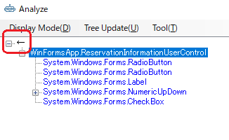

## Multi UserControl Dialogのドライバの作成

次は2つのUserContorlが含まれているMultiUserControlFormのドライバを作成します。
対象アプリケーションのMainFrameのメニューから[etc] - [Multi UserControl Dialog]を選択して、ダイアログを表示します。


最初に右側のUserControlのドライバを作りみます。
ツリー上で[ReservationInformationUserControl]を選択し、右クリックから[Change The Analysis Target]を選択します。
解析対象が切り替わり、UI解析ツリーおよびDesignerタブの内容が[ReservationInformationUserControl]を起点にした内容で置き換わります。
必要なコントロールを Designer に登録して Generate ボタンでコードを生成します。


```cs
using Codeer.Friendly;
using Codeer.Friendly.Dynamic;
using Codeer.Friendly.Windows.Grasp;
using Codeer.TestAssistant.GeneratorToolKit;
using Ong.Friendly.FormsStandardControls;

namespace Driver.Windows
{
    [UserControlDriver(TypeFullName = "WinFormsApp.ReservationInformationUserControl")]
    public class ReservationInformationUserControlDriver
    {
        public WindowControl Core { get; }
        public FormsRadioButton _radioButtonAlacarte => Core.Dynamic()._radioButtonAlacarte; 
        public FormsRadioButton _radioButtonCourse => Core.Dynamic()._radioButtonCourse; 
        public FormsNumericUpDown numericUpDown1 => Core.Dynamic().numericUpDown1; 
        public FormsCheckBox _checkBoxSmoking => Core.Dynamic()._checkBoxSmoking; 

        public ReservationInformationUserControlDriver(WindowControl core)
        {
            Core = core;
        }

        public ReservationInformationUserControlDriver(AppVar core)
        {
            Core = new WindowControl(core);
        }
    }
}
```
解析対象を親ウィンドウ戻すにはツリーのルートの[←]をダブルクリックするか、そこを右クリックで[Change The Analysis Target]を選択します。



次に左側のUserControlに対するコードを生成します。今回はドライバを作成せずFormに直接UserControlの要素を配置します。
UserControlDriverを作るか親のWindowDriverに直接配置するかはそのときどきで判断してください。ダイアログで常に表示されているUserControlである並ば親のWindowDriverに直接配置しても良い場合が多いです。
UI解析ツリーの[ChangeOfPartyUserControl]の下に表示されている2つのテキストボックスをダブルクリックしてDesignerタブのグリッドに追加してください。
またReservationInformationUserControlも追加してください。先ほど作ったReservationInformationUserControlDriverが割り当たります。


[Generate]ボタンをクリックしてコードを生成します。

```cs
using Codeer.Friendly;
using Codeer.Friendly.Dynamic;
using Codeer.Friendly.Windows;
using Codeer.Friendly.Windows.Grasp;
using Codeer.TestAssistant.GeneratorToolKit;
using Ong.Friendly.FormsStandardControls;

namespace Driver.Windows
{
    [WindowDriver(TypeFullName = "WinFormsApp.MultiUserControlForm")]
    public class MultiUserControlFormDriver
    {
        public WindowControl Core { get; }
        public ReservationInformationUserControlDriver reservationInformationUserControl1
             => new ReservationInformationUserControlDriver(Core.Dynamic().reservationInformationUserControl1); 
        public FormsTextBox _textBoxTel => Core.Dynamic().chargeOfPartyUserControl1._textBoxTel; 
        public FormsTextBox _textBoxName => Core.Dynamic().chargeOfPartyUserControl1._textBoxName; 

        public MultiUserControlFormDriver(WindowControl core)
        {
            Core = core;
        }

        public MultiUserControlFormDriver(AppVar core)
        {
            Core = new WindowControl(core);
        }
    }

    public static class MultiUserControlFormDriverExtensions
    {
        [WindowDriverIdentify(TypeFullName = "WinFormsApp.MultiUserControlForm")]
        public static MultiUserControlFormDriver AttachMultiUserControlForm(this WindowsAppFriend app)
            => app.WaitForIdentifyFromTypeFullName("WinFormsApp.MultiUserControlForm").Dynamic();
    }
}
```
## 次の手順
[MainFormのドライバの作成](WindowDriver4.md)
