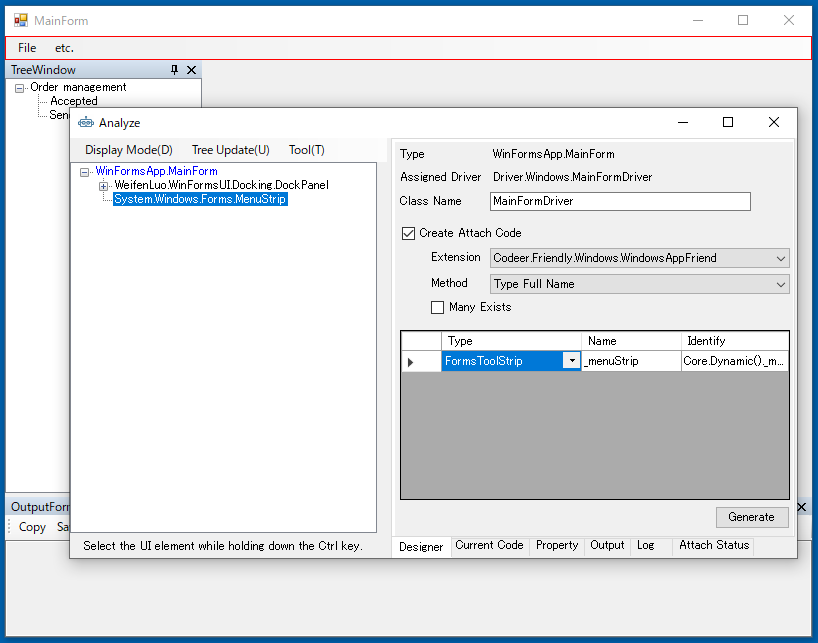

## MainFormのドライバの作成

MainForm は複数のドッキングウィンドウで構成されています。ここでは MainForm はメニューだけを持つウィンドウと考えます。残りのTreeFormやOutputFormはUserControlをAttach形式で作成します。（のちほど説明します）
メニューだけをプロパティに追加して、ドライバを生成してください。



```cs
using Codeer.Friendly;
using Codeer.Friendly.Dynamic;
using Codeer.Friendly.Windows;
using Codeer.Friendly.Windows.Grasp;
using Codeer.TestAssistant.GeneratorToolKit;
using Ong.Friendly.FormsStandardControls;

namespace Driver.Windows
{
    [WindowDriver(TypeFullName = "WinFormsApp.MainForm")]
    public class MainFormDriver
    {
        public WindowControl Core { get; }
        public FormsToolStrip _menuStrip => Core.Dynamic()._menuStrip; 

        public MainFormDriver(WindowControl core)
        {
            Core = core;
        }

        public MainFormDriver(AppVar core)
        {
            Core = new WindowControl(core);
        }
    }

    public static class MainFormDriverExtensions
    {
        [WindowDriverIdentify(TypeFullName = "WinFormsApp.MainForm")]
        public static MainFormDriver AttachMainForm(this WindowsAppFriend app)
            => app.WaitForIdentifyFromTypeFullName("WinFormsApp.MainForm").Dynamic();
    }
}
```

## 次の手順
[TreeFormとOutputForm のドライバの作成](WindowDriver5.md)
